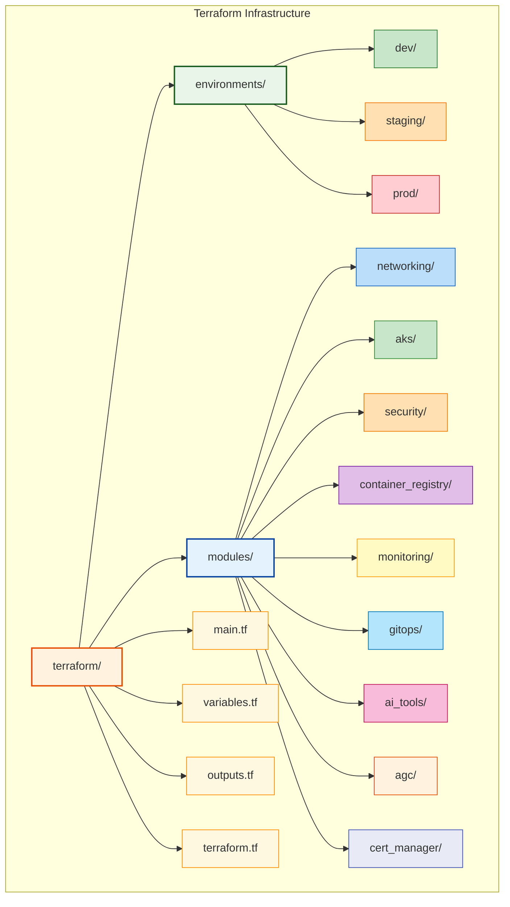

# Azure AKS GitOps Platform

A comprehensive Terraform-based GitOps platform for Azure Kubernetes Service, demonstrating production-ready DevOps practices, cloud security principles, and modern application deployment workflows.

## Table of Contents

- [Project Overview](#project-overview)
- [Architecture](#architecture)
- [Key Features](#key-features)
- [What This Creates](#what-this-creates)
- [Quick Start](#quick-start)
- [Documentation](#documentation)
- [Support](#support)

## Project Overview

This project showcases:
- **Infrastructure as Code** using Terraform for Azure
- **GitOps workflows** with ArgoCD for application deployment
- **Containerization** with Docker and Kubernetes (AKS)
- **CI/CD pipelines** with GitHub Actions
- **Application Gateway for Containers (AGC)** for cloud-native load balancing with Gateway API
- **AI/ML platform** with JupyterHub, MLflow, and GPU support
- **Cloud security** best practices and compliance
- **Modular architecture** for reusable infrastructure components

## Architecture



## Key Features

### Infrastructure Components
- **Virtual Networks** with proper subnetting and security groups
- **Azure Kubernetes Service (AKS)** with auto-scaling and monitoring
- **Application Gateway for Containers (AGC)** for cloud-native ingress and SSL termination
- **Key Vault** for secrets management and SSL certificates
- **Log Analytics** and comprehensive monitoring solutions
- **Container Registry** with private endpoints for Docker images
- **AI/ML node pools** with GPU support for machine learning workloads

### Security Features
- **Environment isolation** - Explicit environment specification required (no defaults)
- Network security groups and application security groups
- Azure Active Directory integration
- Role-based access control (RBAC)
- Private endpoints for secure connectivity
- Encryption at rest and in transit

### DevOps & GitOps Practices
- **GitOps workflows** with ArgoCD for declarative application management
- **Automated Terraform** validation, planning, and deployment
- **Multi-environment** deployment pipelines with approval gates
- **Infrastructure drift detection** and automated alerting
- **Security scanning** with Checkov and TFSec integration
- **Cost optimization** monitoring with Infracost integration
- **Automated CI/CD** with GitHub Actions workflows

## What This Creates

This Terraform configuration creates a **complete, production-ready AKS platform** including:

### Core Infrastructure
- **Resource Group** - Dedicated resource group for all resources
- **Virtual Network** - Complete VNet with 4 subnets (AKS, AGC, Private Endpoints)
- **AKS Cluster** - Multi-node pool cluster with system, user, and AI/ML (GPU) node pools
- **Application Gateway for Containers** - Cloud-native load balancing with Gateway API
- **Container Registry** - Private container registry with private endpoints
- **Key Vault** - Secrets and certificate management with SSL certificates
- **cert-manager** - Automatic SSL certificate management with Let's Encrypt integration
- **Monitoring** - Log Analytics, Application Insights, Prometheus, Grafana

### Platform Services (via Helm)
- **ArgoCD** - GitOps platform for application deployment
- **JupyterHub** - Data science platform with GPU support
- **MLflow** - ML lifecycle management with PostgreSQL and MinIO
- **Monitoring Stack** - Prometheus, Grafana, Loki for observability

## Prerequisites

### Core Tools
- Azure CLI installed and configured
- Terraform >= 1.0
- Docker (for containerization examples)
- kubectl (for Kubernetes management)
- Bash shell (Linux/macOS native, Windows via WSL2 or Git Bash)

### Python Environment
- Python 3.7+ with pip
- Virtual environment (recommended for dependency isolation)

#### Quick Python Setup
```bash
# Create and activate virtual environment
./scripts/setup-python-env.sh
source venv/bin/activate

# Install all required dependencies
make install-deps

# Verify setup (should show all packages installed)
python3 scripts/check-python-env.py
```

#### Manual Setup (Alternative)
```bash
python3 -m venv venv
source venv/bin/activate  # Linux/macOS
# venv\Scripts\activate   # Windows

# Install dependencies
pip install -r scripts/requirements.txt
```

#### Check Environment Status
```bash
# Check Python environment and virtual environment status
python3 scripts/check-python-env.py

# Or use the Makefile
make status
```

## Cost Monitoring Examples

Monitor your Azure spending with built-in cost monitoring tools:

### Quick Cost Check
```bash
# Current month actual costs (uses default: aks-platform)
./scripts/cost-monitor.sh

# Or with custom project name
./scripts/cost-monitor.sh --project-name "my-company-platform"

# Cost estimates for planning
./scripts/cost-monitor.sh --estimate --env dev
./scripts/cost-monitor.sh --estimate --env prod --region westus2
```

### Budget Monitoring
```bash
# Set up budget alerts with notifications
./scripts/cost-monitor.sh --budget 1000 \
  --webhook "https://hooks.slack.com/services/YOUR/SLACK/WEBHOOK"

# Daily automated monitoring
./scripts/cost-monitor.sh --schedule daily --budget 500
```

### Cost Dashboard
```bash
# Generate HTML dashboard
./scripts/cost-monitor.sh --dashboard

# Serve live dashboard
./scripts/cost-monitor.sh --dashboard --serve --port 8080
```

### Estimated Monthly Costs (US East)
- **Development**: $220-650 (base/with AI/ML)
- **Staging**: $380-1220 (base/with AI/ML)
- **Production**: $1000-3600 (base/with AI/ML)

## Quick Start

**Important**: This project requires a greenfield bootstrap process to avoid the "chicken and egg" problem with Terraform state backends and provider dependencies.

### Greenfield Bootstrap (Required for New Deployments)

**Step 1: Environment Setup**
```bash
git clone git@github.com:cmcconnell1/aks-platform.git
cd aks-platform

# Set up Python virtual environment and dependencies
./scripts/setup-python-env.sh
source venv/bin/activate

# Verify environment
python3 scripts/check-python-env.py
```

**Step 2: Azure Infrastructure Bootstrap**
```bash
# Authenticate with Azure
az login
az account set --subscription "your-subscription-id"

# Create foundational infrastructure (storage accounts, service principals)
./scripts/setup-azure-credentials.sh --project-name "aks-platform" --location "East US"

# Configure GitHub secrets for CI/CD
gh auth login
./scripts/setup-github-secrets.sh
```

**Step 3: Commit Bootstrap Configuration**
```bash
# Add generated backend configurations
git add terraform/environments/*/backend.conf
git add terraform/environments/*/terraform.tfvars
git commit -m "feat: add Azure backend configuration and environment variables"
git push origin main  # This will now trigger successful deployment
```

### Why Bootstrap is Required

The platform has these dependencies that must be created in order:
1. **Storage Account** → Required for Terraform state backend
2. **Service Principal** → Required for Terraform Azure authentication
3. **Provider Declarations** → Required for kubectl and http providers (cert-manager)
4. **GitHub Secrets** → Required for CI/CD pipeline authentication

### Deployment Scenarios

#### New to Azure
Start with the [**Greenfield Setup Guide**](docs/greenfield-setup-guide.md) for a complete walkthrough including:
- Azure account setup and permissions
- Cost estimation and optimization
- Step-by-step deployment process

#### Bootstrap Validation
Use the [**Bootstrap Checklist**](docs/bootstrap-checklist.md) to ensure proper setup:
- Complete prerequisite validation
- Step-by-step bootstrap verification
- Common issue troubleshooting
- Success criteria validation

#### Existing Azure Environment
See the [**Existing Infrastructure Guide**](docs/existing-infrastructure-guide.md) for:
- Integration with existing AKS clusters
- IP range and naming customization
- Platform-services-only deployment

## Development Workflow

This project follows Python best practices with virtual environment isolation and comprehensive tooling.

### Environment Setup
```bash
# Set up development environment with all tools
make setup-dev

# Or manually
./scripts/setup-python-env.sh --dev
source venv/bin/activate
```

### Common Development Tasks
```bash
# Check environment status
make status

# Run code quality checks
make check

# Format code
make format

# Run tests
make test

# Security audit
make security-audit

# Clean up
make clean
```

### Dependency Management
```bash
# Check dependencies
python3 scripts/manage-dependencies.py check

# Update dependencies
python3 scripts/manage-dependencies.py update

# Security audit
python3 scripts/manage-dependencies.py audit

# Generate frozen requirements
python3 scripts/manage-dependencies.py freeze
```

### Virtual Environment Best Practices
- Always use virtual environments for Python development
- Activate virtual environment before running scripts
- Use pinned versions in requirements.txt for reproducibility
- Separate requirements files for different purposes (dev, test, prod)
- Regular security audits of dependencies

## Documentation

### Getting Started
| Guide | Description | Best For |
|-------|-------------|----------|
| [**Greenfield Setup Guide**](docs/greenfield-setup-guide.md) | Complete Azure setup from scratch | New Azure users |
| [**Pipeline Deployment Guide**](docs/pipeline-deployment-guide.md) | Automated GitHub Actions deployment | Production deployments |
| [**Quick Start Guide**](docs/quick-start.md) | 5-minute deployment | Experienced users |
| [**No Domain Setup**](docs/no-domain-setup.md) | Deploy without owning a domain | Testing/development |

### Deployment & Integration
| Guide | Description |
|-------|-------------|
| [**Greenfield Deployment Validation**](docs/greenfield-deployment-validation.md) | Complete validation checklist and methods |
| [**Certificate Management Guide**](docs/certificate-management-guide.md) | SSL/TLS certificate options and setup |
| [**Deployment Guide**](docs/deployment-guide.md) | Comprehensive deployment instructions |
| [**Existing Infrastructure Guide**](docs/existing-infrastructure-guide.md) | Integration with existing Azure environments |
| [**Let's Encrypt Integration**](docs/letsencrypt-integration.md) | Automatic SSL certificate management |

### Operations & Security
| Guide | Description |
|-------|-------------|
| [**Architecture Guide**](docs/architecture.md) | System architecture and design decisions |
| [**Platform Design Philosophy**](docs/platform-design-philosophy.md) | Design decisions and trade-offs |
| [**Security Guide**](docs/security.md) | Security best practices and configurations |
| [**CI/CD Guide**](docs/cicd-guide.md) | GitHub Actions workflows and automation |
| [**Helm Management Guide**](docs/helm-management-guide.md) | Helm chart management and GitOps workflows |
| [**Cost Monitoring Guide**](docs/cost-monitoring-guide.md) | Real-time Azure cost monitoring and budget alerts |
| [**AI/ML Workloads Guide**](docs/ai-ml-workloads-guide.md) | GPU node scheduling and AI/ML platform usage |

### Infrastructure Management
| Script | Description | Usage |
|--------|-------------|-------|
| `./scripts/show-infrastructure.sh` | **Infrastructure overview** - Shows all deployed resources by environment | `./scripts/show-infrastructure.sh --all --costs` |
| [**Troubleshooting**](docs/troubleshooting.md) | Common issues and solutions |
| [**Production Update Strategy**](docs/production-update-strategy.md) | Safe production deployment procedures |
| [**Cleanup Guide**](docs/cleanup-guide.md) | Complete infrastructure removal |

## Common Bootstrap Issues & Solutions

### Issue: "Storage Account Not Found" Error
```
Error: retrieving Storage Account: ResourceNotFound
```
**Solution**: Run the bootstrap process first:
```bash
./scripts/setup-azure-credentials.sh --project-name "aks-platform"
```

### Issue: "kubectl provider not found" Error
```
Error: Failed to query available provider packages
Could not retrieve the list of available versions for provider hashicorp/kubectl
```
**Solution**: This was fixed in commit `b0ba3a1`. Update your terraform.tf:
```hcl
kubectl = {
  source  = "gavinbunney/kubectl"
  version = "~> 1.14"
}
```

### Issue: Multiple Workflow Runs on Same Commit
**Solution**: The terraform-deploy workflow now includes concurrency control:
```yaml
concurrency:
  group: terraform-deploy-${{ github.ref }}
  cancel-in-progress: false
```

### Issue: Terraform Dependency Cycle Error
```
Error: Cycle: module.aks.azurerm_role_assignment.aks_acr_pull, module.aks.azurerm_kubernetes_cluster.main
```
**Solution**: Fixed in commit `1e591f6` - removed circular dependency between AKS cluster and ACR role assignment.

### Issue: Cost-monitoring Workflow Triggering on Push
**Solution**: Fixed in commit `f86c830` - cost-monitoring now only runs on schedule or manual dispatch.

### Issue: Deprecated quarantine_policy in Container Registry
```
Error: Unsupported block type "quarantine_policy"
```
**Solution**: Fixed in commit `9c1a50c` - removed deprecated quarantine_policy block from Azure Container Registry.

### Issue: Spot Instance Configuration in Default Node Pool
```
Error: Unsupported argument "priority" in default node pool
```
**Solution**: Fixed in commit `eedd0ee` - removed spot instance config from default node pool (system workloads require guaranteed availability).

### Issue: "Chicken and Egg" Problem
**Root Cause**: Terraform needs storage account → Storage account needs service principal → Service principal needs Azure access

**Solution**: Always run the complete bootstrap sequence before attempting Terraform deployment.

## Support

For questions or issues, please create an issue in this repository or contact cmcc.
