# Architecture Guide

This guide explains the system architecture and design decisions for the Azure AKS GitOps platform.

## High-Level Architecture

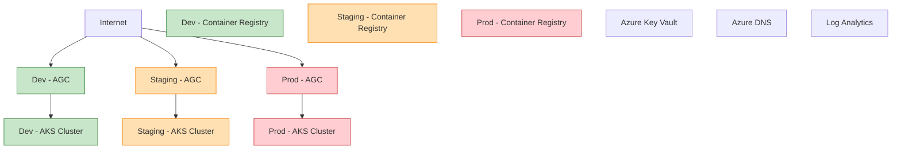

## Core Components

### Infrastructure Layer (Terraform-Managed)

#### **Networking**

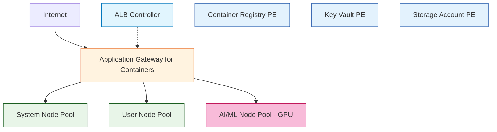

#### **Compute**
- **AKS Cluster**: Multi-node pool architecture
  - **System Pool**: `Standard_D2s_v3` (2-10 nodes)
  - **User Pool**: `Standard_D2s_v3` (1-10 nodes)  
  - **AI/ML Pool**: `Standard_NC6s_v3` (0-2 nodes, GPU-enabled)

#### **Storage & Data**
- **Azure Container Registry**: Premium tier with private endpoints
- **Azure Key Vault**: Certificate and secret management
- **Storage Accounts**: Terraform state and application data
- **Persistent Volumes**: Azure Disk CSI driver

#### **Security**
- **Azure Active Directory**: Identity and access management
- **Network Security Groups**: Traffic filtering
- **Private Endpoints**: Secure connectivity
- **Application Gateway for Containers**: Cloud-native load balancing with Gateway API

### AKS Cluster Configuration

#### **AKS Add-ons (Azure-Managed)**

These are first-party Azure features enabled directly on the AKS cluster. Azure manages upgrades and availability.

| Add-on | Purpose | Configuration |
|--------|---------|---------------|
| **OMS Agent** | Azure Monitor Container Insights | `oms_agent { log_analytics_workspace_id = "..." }` |
| **Microsoft Defender** | Runtime threat protection, vulnerability scanning | `microsoft_defender { log_analytics_workspace_id = "..." }` |
| **Azure Policy** | Kubernetes policy enforcement | `azure_policy_enabled = true` |
| **Key Vault Secrets Provider** | Mount secrets from Key Vault | `key_vault_secrets_provider { secret_rotation_enabled = true }` |
| **Image Cleaner** | Automatic cleanup of stale images | `image_cleaner_enabled = true` |
| **Storage CSI Drivers** | Azure Blob, Disk, File storage | `storage_profile { blob_driver_enabled = true ... }` |

```hcl
# From terraform/modules/aks/main.tf

# Azure Monitor Container Insights
oms_agent {
  log_analytics_workspace_id = var.log_analytics_workspace_id
}

# Microsoft Defender for Containers
microsoft_defender {
  log_analytics_workspace_id = var.log_analytics_workspace_id
}

# Azure Policy for Kubernetes
azure_policy_enabled = true

# Key Vault Secrets Provider (CSI Driver)
key_vault_secrets_provider {
  secret_rotation_enabled  = true
  secret_rotation_interval = "2m"
}

# Image Cleaner
image_cleaner_enabled        = true
image_cleaner_interval_hours = 48

# Storage Profile - CSI Drivers
storage_profile {
  blob_driver_enabled         = true
  disk_driver_enabled         = true
  file_driver_enabled         = true
  snapshot_controller_enabled = true
}

# Disable run command in production
run_command_enabled = var.enable_run_command
```

#### **AKS Cluster Features**

Core cluster capabilities enabled via Terraform:

| Feature | Purpose | Configuration |
|---------|---------|---------------|
| **Workload Identity** | Pod-to-Azure authentication | `workload_identity_enabled = true` |
| **OIDC Issuer** | Federated identity support | `oidc_issuer_enabled = true` |
| **Azure RBAC** | Azure AD for K8s authorization | `azure_rbac_enabled = true` |
| **Network Policy** | Pod-to-pod traffic control | `network_policy = "azure"` |
| **Private Cluster** | Private API server (prod only) | `private_cluster_enabled = var.enable_private_cluster` |

#### **Node Pools**

| Pool | Purpose | VM Size | Labels | Taints |
|------|---------|---------|--------|--------|
| **System** | Critical add-ons | Standard_D2s_v3 | `node-type=system` | `CriticalAddonsOnly=true:NoSchedule` |
| **User** | Application workloads | Standard_D2s_v3 | `node-type=user` | None |
| **AI** | GPU/ML workloads | Standard_NC6s_v3 | `node-type=ai`, `accelerator=nvidia-gpu` | `nvidia.com/gpu=true:NoSchedule` |

### Platform Layer (Helm-Managed)

These are self-managed services deployed via Helm charts. You control versions, configuration, and upgrades.

| Service | Helm Chart | Namespace | Purpose |
|---------|------------|-----------|---------|
| **ArgoCD** | `argo/argo-cd` | `argocd` | GitOps continuous delivery |
| **Prometheus** | `prometheus-community/kube-prometheus-stack` | `monitoring` | Metrics collection and alerting |
| **Grafana** | (included in prometheus-stack) | `monitoring` | Dashboards and visualization |
| **Loki** | `grafana/loki` | `monitoring` | Log aggregation |
| **cert-manager** | `jetstack/cert-manager` | `cert-manager` | TLS certificate automation |
| **JupyterHub** | `jupyterhub/jupyterhub` | `ai-tools` | Multi-user notebook server |
| **MLflow** | `community-charts/mlflow` | `ai-tools` | ML experiment tracking |

#### **GitOps Platform**

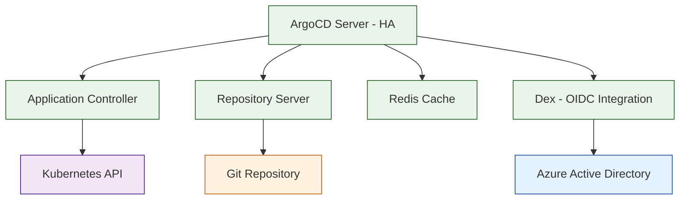

#### **Monitoring Stack**

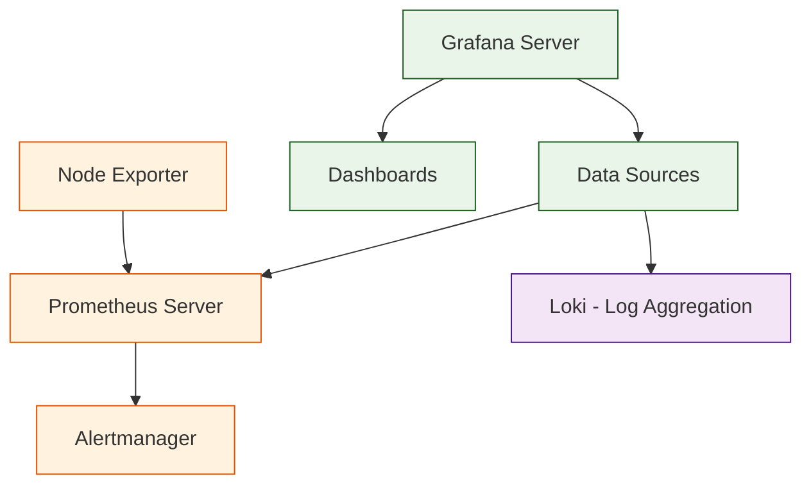

#### **AI/ML Platform**

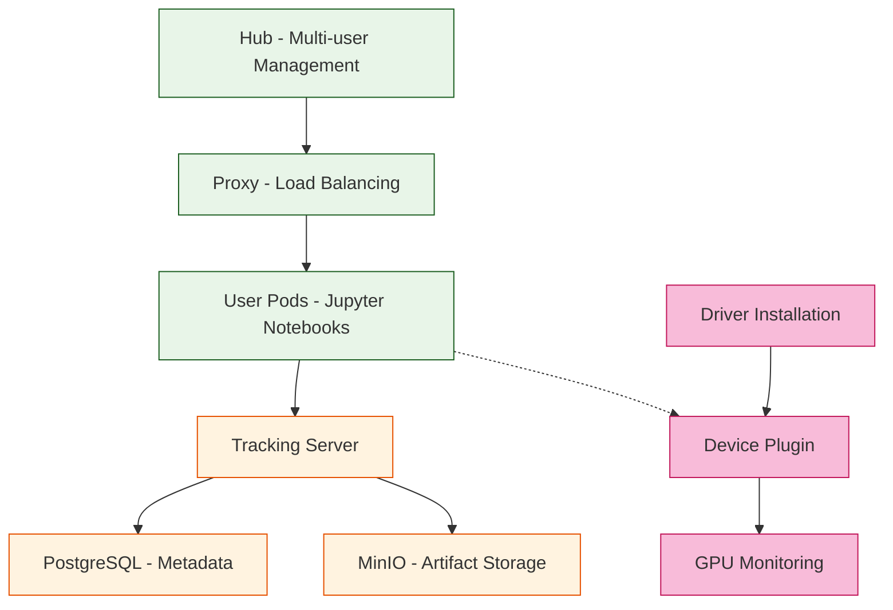

## Design Principles

### **Infrastructure as Code**
- **Declarative Configuration**: All infrastructure defined in Terraform
- **Version Control**: Infrastructure changes tracked in Git
- **Environment Parity**: Consistent configuration across environments
- **Modular Design**: Reusable Terraform modules

### **GitOps Methodology**
- **Git as Source of Truth**: All configurations stored in Git
- **Automated Deployment**: ArgoCD manages application lifecycle
- **Continuous Reconciliation**: Automatic drift detection and correction
- **Audit Trail**: Complete history of changes

### **Security by Design**
- **Zero Trust Network**: Private endpoints and network segmentation
- **Least Privilege Access**: RBAC and minimal permissions
- **Encryption Everywhere**: Data encrypted at rest and in transit
- **Secret Management**: Azure Key Vault integration

### **Observability First**
- **Comprehensive Monitoring**: Metrics, logs, and traces
- **Proactive Alerting**: Early detection of issues
- **Performance Optimization**: Resource utilization tracking
- **Business Metrics**: Application-specific KPIs

## Data Flow Architecture

### **CI/CD Pipeline Flow**

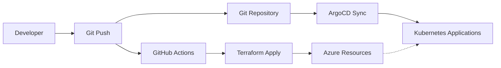

### **Application Deployment Flow**

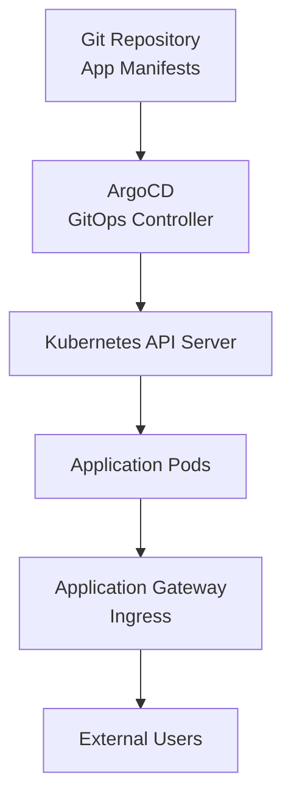

### **Monitoring Data Flow**

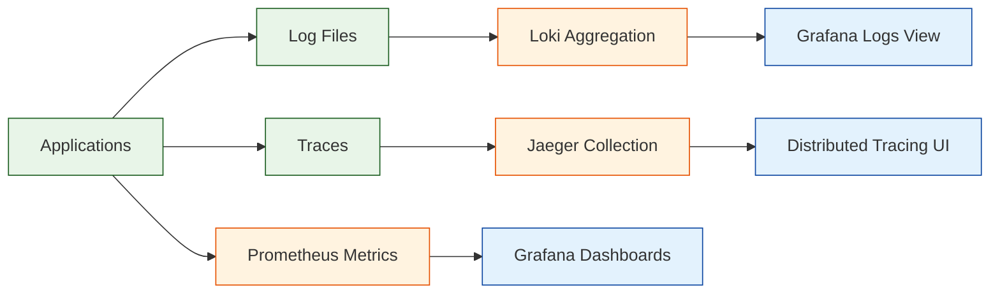

## Network Architecture

### **Traffic Flow**

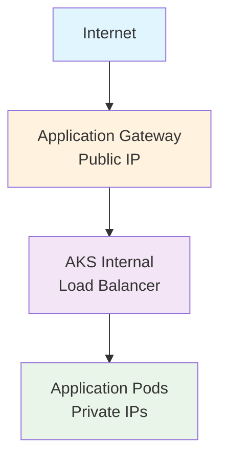

### **Security Zones**
- **DMZ Zone**: Application Gateway subnet
- **Compute Zone**: AKS cluster subnet
- **Data Zone**: Private endpoints subnet
- **Management Zone**: Bastion/jump box (optional)

## Scalability Design

### **Horizontal Scaling**
- **AKS Node Pools**: Auto-scaling based on demand
- **Application Pods**: HPA (Horizontal Pod Autoscaler)
- **Database Connections**: Connection pooling
- **Load Distribution**: Multiple availability zones

### **Vertical Scaling**
- **Resource Limits**: CPU and memory constraints
- **Storage Expansion**: Dynamic volume provisioning
- **Performance Tiers**: Premium storage for critical workloads

## High Availability

### **Infrastructure HA**
- **Multi-Zone Deployment**: Availability zones for resilience
- **Load Balancing**: Traffic distribution across nodes
- **Backup Strategy**: Automated backups for stateful services
- **Disaster Recovery**: Cross-region replication (optional)

### **Application HA**
- **Pod Disruption Budgets**: Maintain minimum replicas
- **Health Checks**: Liveness and readiness probes
- **Circuit Breakers**: Fault tolerance patterns
- **Graceful Shutdown**: Proper termination handling

## Security Architecture

### **Identity and Access**

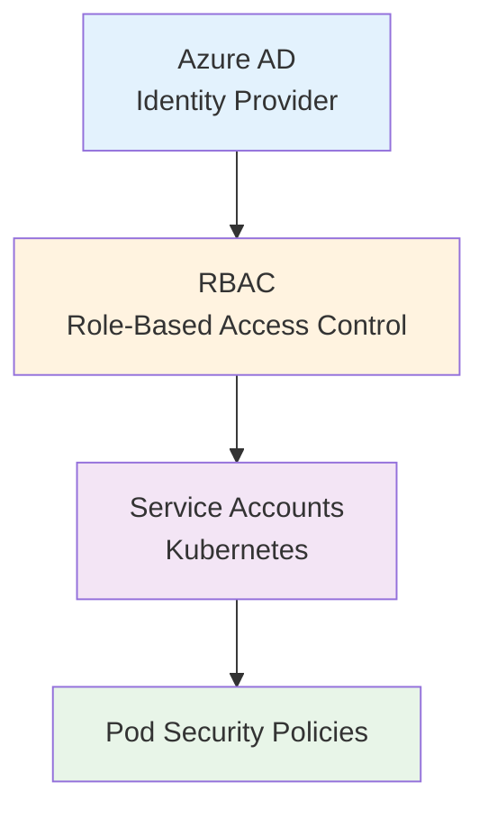

### **Network Security**

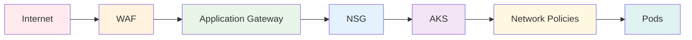

### **Data Protection**
- **Encryption at Rest**: Azure Disk Encryption
- **Encryption in Transit**: TLS 1.2+ everywhere
- **Secret Management**: Azure Key Vault CSI driver
- **Certificate Management**: cert-manager with Let's Encrypt

## Performance Considerations

### **Resource Optimization**
- **Right-Sizing**: Appropriate resource requests/limits
- **Caching Strategy**: Redis for session data
- **CDN Integration**: Static content delivery
- **Database Optimization**: Connection pooling and indexing

### **Monitoring and Alerting**
- **SLI/SLO Definition**: Service level objectives
- **Performance Metrics**: Response time, throughput, error rate
- **Capacity Planning**: Resource utilization trends
- **Cost Optimization**: Resource usage analysis

## Technology Stack

### **Infrastructure**
- **Cloud Provider**: Microsoft Azure
- **Container Orchestration**: Azure Kubernetes Service (AKS)
- **Infrastructure as Code**: Terraform
- **CI/CD**: GitHub Actions

### **Platform Services**
- **GitOps**: ArgoCD
- **Monitoring**: Prometheus + Grafana
- **Logging**: Loki
- **Tracing**: Jaeger (optional)
- **Service Mesh**: Istio (optional)

### **AI/ML Stack**
- **Notebooks**: JupyterHub
- **ML Lifecycle**: MLflow
- **GPU Computing**: NVIDIA GPU Operator
- **Model Serving**: Kubeflow (optional)

## Future Considerations

### **Planned Enhancements**
- **Service Mesh**: Istio for advanced traffic management
- **Multi-Cluster**: Federation across regions
- **Advanced AI/ML**: Kubeflow Pipelines integration
- **Compliance**: Additional security frameworks

### **Scalability Roadmap**
- **Global Load Balancing**: Azure Front Door (see detailed section below)
- **Edge Computing**: Azure IoT Edge integration
- **Hybrid Cloud**: Azure Arc for on-premises
- **Serverless**: Azure Container Instances integration

---

## Azure Front Door (Future Option)

Azure Front Door is **not currently implemented** but is available as a future enhancement when global load balancing, advanced WAF, or multi-region capabilities are needed.

### **Features and Benefits**

| Feature | Benefit |
|---------|---------|
| **Global Load Balancing** | Route traffic to nearest healthy backend across regions |
| **WAF (Web Application Firewall)** | OWASP protection, bot mitigation, DDoS protection |
| **SSL Offloading** | Managed certificates, TLS termination at edge |
| **Caching** | Edge caching for static content, reduced latency |
| **URL Rewriting/Routing** | Path-based routing, redirects, header manipulation |
| **Health Probes** | Automatic failover to healthy backends |
| **Private Link** | Secure connectivity to private AKS clusters |
| **Multi-region HA** | Active-active or active-passive deployments |

### **Architecture Comparison**

```
CURRENT ARCHITECTURE:
+----------+     +---------------------+     +-------------+
| Internet | --> | AGC (regional)      | --> | AKS Cluster |
+----------+     +---------------------+     +-------------+

WITH AZURE FRONT DOOR:
+----------+     +---------------------------+     +-----+     +-----+
| Internet | --> | Azure Front Door          | --> | AGC | --> | AKS |
+----------+     | (global edge network)     |     +-----+     +-----+
                 +---------------------------+
                           |
                 +---------+---------+
                 |         |         |
                 v         v         v
              WAF      Caching    Multi-region
           Protection            Routing
```

### **When to Implement**

Consider implementing Azure Front Door when:

| Trigger | Scenario |
|---------|----------|
| **Global Users** | Users accessing from multiple geographic regions |
| **WAF Requirements** | Compliance requires OWASP protection or bot mitigation |
| **DDoS Protection** | Need enterprise-grade DDoS protection beyond Azure defaults |
| **Multi-Region HA** | Deploying AKS clusters in multiple regions for disaster recovery |
| **Edge Caching** | Significant static content that benefits from edge caching |
| **Private Backend** | Production requires private AGC with Front Door Private Link |

### **Cost Considerations**

| Tier | Base Cost | Features | Use Case |
|------|-----------|----------|----------|
| **Front Door Standard** | ~$35/month | Basic routing, SSL, caching | Dev/staging, simple routing |
| **Front Door Premium** | ~$330/month | + WAF, Private Link, advanced analytics | Production with security requirements |

**Additional costs:**
- Per-request charges (~$0.01 per 10,000 requests)
- Data transfer (varies by region)
- WAF rules (if using managed rule sets)

**Cost comparison with current architecture:**
- Current (AGC only): ~$0 base + data transfer
- With Front Door Standard: +$35/month + per-request
- With Front Door Premium: +$330/month + per-request + WAF

### **Trade-offs**

| Consideration | Without Front Door | With Front Door |
|---------------|-------------------|-----------------|
| **Complexity** | Simpler architecture | Additional layer to manage |
| **Cost** | Lower | Higher base + usage costs |
| **Latency** | Direct to region | Edge optimization (usually lower) |
| **WAF** | None (or separate Azure WAF) | Integrated, managed rules |
| **Multi-region** | Manual DNS failover | Automatic health-based routing |
| **SSL Management** | cert-manager / AGC | Front Door managed certs |
| **Debugging** | Simpler path | Additional hop to trace |

### **Implementation Approach (When Ready)**

When the decision is made to implement Azure Front Door:

1. **Create Terraform module** (`terraform/modules/front_door/`)
   - Front Door profile (Standard or Premium)
   - WAF policy with OWASP managed rules
   - Origin groups pointing to AGC endpoints
   - Routes for each service

2. **Configure endpoints**
   - Custom domains with managed certificates
   - Routing rules for ArgoCD, Grafana, JupyterHub, MLflow
   - Caching rules for static content

3. **Production security**
   - Private Link to AGC (Premium tier required)
   - WAF in prevention mode
   - Geo-filtering if required

4. **DNS migration**
   - Update DNS to point to Front Door endpoint
   - Validate routing and SSL

### **Related Documentation**
- [Microsoft Docs: Azure Front Door](https://docs.microsoft.com/azure/frontdoor/)
- [Front Door + AKS Integration](https://docs.microsoft.com/azure/frontdoor/front-door-overview)
- [WAF on Front Door](https://docs.microsoft.com/azure/web-application-firewall/afds/afds-overview)

---

## Service Mesh - Istio (Future Option)

Istio is **not currently implemented** but provides advanced traffic management, security, and observability capabilities when needed.

### **Features and Benefits**

| Feature | Benefit |
|---------|---------|
| **mTLS (Mutual TLS)** | Automatic encryption between all services |
| **Traffic Management** | Canary deployments, A/B testing, traffic splitting |
| **Circuit Breaking** | Prevent cascade failures with automatic circuit breakers |
| **Rate Limiting** | Protect services from overload |
| **Observability** | Distributed tracing, metrics, access logs |
| **Authorization Policies** | Fine-grained access control between services |
| **Fault Injection** | Test resilience by injecting failures |
| **Retries/Timeouts** | Automatic retry logic and timeout management |

### **Architecture with Istio**

```
+------------------+     +------------------+     +------------------+
|   Service A      | --> |  Envoy Sidecar   | --> |  Envoy Sidecar   | --> Service B
+------------------+     +------------------+     +------------------+
                                  |
                         +--------v--------+
                         |  Istio Control  |
                         |     Plane       |
                         +-----------------+
                                  |
                    +-------------+-------------+
                    |             |             |
                 Pilot        Citadel       Galley
              (traffic)     (security)    (config)
```

### **When to Implement**

| Trigger | Scenario |
|---------|----------|
| **Zero-Trust Security** | Require mTLS between all services |
| **Complex Routing** | Canary deployments, A/B testing needs |
| **Microservices Architecture** | Many services requiring traffic management |
| **Compliance** | Audit requirements for service-to-service communication |
| **Resilience Testing** | Need fault injection and chaos engineering |

### **Cost Considerations**

| Cost Type | Impact |
|-----------|--------|
| **Compute Overhead** | ~10-15% additional CPU/memory per pod (sidecar) |
| **Operational Complexity** | Requires Istio expertise for troubleshooting |
| **Latency** | ~1-3ms additional latency per hop |

### **Trade-offs**

| Consideration | Without Istio | With Istio |
|---------------|--------------|------------|
| **Complexity** | Simpler architecture | Additional control plane |
| **Resource Usage** | Lower | +10-15% CPU/memory overhead |
| **mTLS** | Manual configuration | Automatic, transparent |
| **Traffic Control** | Basic Kubernetes | Advanced routing, splitting |
| **Debugging** | Direct service calls | Additional proxy layer |
| **Learning Curve** | Lower | Requires Istio expertise |

### **Implementation Approach (When Ready)**

1. Install Istio control plane via Helm
2. Enable sidecar injection per namespace
3. Configure PeerAuthentication for mTLS
4. Create VirtualServices for traffic management
5. Set up Kiali dashboard for visualization

### **Related Documentation**
- [Istio Documentation](https://istio.io/latest/docs/)
- [Istio on AKS](https://docs.microsoft.com/azure/aks/servicemesh-istio-about)

---

## Azure Arc (Future Option)

Azure Arc is **not currently implemented** but enables hybrid and multi-cloud Kubernetes management.

### **Features and Benefits**

| Feature | Benefit |
|---------|---------|
| **Unified Management** | Manage on-premises, edge, and multi-cloud K8s from Azure |
| **GitOps with Flux** | Azure-managed GitOps configuration |
| **Azure Policy** | Extend Azure Policy to any Kubernetes cluster |
| **Azure Monitor** | Centralized monitoring across all clusters |
| **Azure Defender** | Security protection for Arc-enabled clusters |
| **Cluster Extensions** | Deploy Azure services to any cluster |
| **Custom Locations** | Create Azure resource targets on any cluster |

### **Architecture with Azure Arc**

```
+------------------+     +------------------+     +------------------+
|  On-Premises K8s |     |    AKS Cluster   |     |   AWS EKS/GKE    |
+--------+---------+     +--------+---------+     +--------+---------+
         |                        |                        |
         +------------------------+------------------------+
                                  |
                         +--------v--------+
                         |   Azure Arc     |
                         |  Control Plane  |
                         +-----------------+
                                  |
                    +-------------+-------------+
                    |             |             |
                 Policy       Monitor      GitOps
```

### **When to Implement**

| Trigger | Scenario |
|---------|----------|
| **Hybrid Cloud** | On-premises Kubernetes clusters to manage |
| **Multi-Cloud** | AWS EKS or GCP GKE clusters alongside AKS |
| **Edge Computing** | Kubernetes at edge locations |
| **Consistent Governance** | Apply same policies across all clusters |
| **Centralized Monitoring** | Single pane of glass for all clusters |

### **Cost Considerations**

| Component | Cost |
|-----------|------|
| **Arc Control Plane** | Free |
| **Arc-enabled Data Services** | Per-vCore pricing |
| **Azure Policy (Arc)** | Free (included) |
| **Azure Monitor (Arc)** | Standard Log Analytics pricing |
| **GitOps (Flux)** | Free for basic, ~$2/cluster/month for advanced |

### **Trade-offs**

| Consideration | Without Arc | With Arc |
|---------------|-------------|----------|
| **Multi-cluster Management** | Manual per-cluster | Unified Azure portal |
| **Policy Consistency** | Manual enforcement | Automatic via Azure Policy |
| **Monitoring** | Per-cluster setup | Centralized Azure Monitor |
| **GitOps** | Self-managed ArgoCD/Flux | Azure-managed Flux |
| **Complexity** | Simpler for single-cluster | Better for multi-cluster |

### **Implementation Approach (When Ready)**

1. Install Arc agents on target clusters
2. Connect clusters to Azure Arc
3. Enable GitOps configurations
4. Apply Azure Policies
5. Configure Azure Monitor integration

### **Related Documentation**
- [Azure Arc-enabled Kubernetes](https://docs.microsoft.com/azure/azure-arc/kubernetes/)
- [GitOps with Flux and Arc](https://docs.microsoft.com/azure/azure-arc/kubernetes/conceptual-gitops-flux2)

---

## Kubeflow (Future Option)

Kubeflow is **not currently implemented** but provides advanced ML pipeline orchestration and model serving.

### **Features and Benefits**

| Feature | Benefit |
|---------|---------|
| **ML Pipelines** | Orchestrate complex ML workflows as DAGs |
| **Experiment Tracking** | Track experiments, parameters, and metrics |
| **Model Serving** | KServe for scalable model inference |
| **Jupyter Notebooks** | Integrated notebook environment |
| **Hyperparameter Tuning** | Katib for automated hyperparameter optimization |
| **Feature Store** | Feast integration for feature management |
| **Multi-Framework** | TensorFlow, PyTorch, XGBoost, and more |

### **Current vs Kubeflow Architecture**

```
CURRENT (JupyterHub + MLflow):
+-------------+     +----------+
| JupyterHub  | --> |  MLflow  | --> Model Registry
+-------------+     +----------+

WITH KUBEFLOW:
+------------------+
|    Kubeflow      |
+--------+---------+
         |
+--------+--------+--------+--------+
|        |        |        |        |
v        v        v        v        v
Pipelines  Notebooks  KServe  Katib  Training
                     (serving) (tuning) (distributed)
```

### **When to Implement**

| Trigger | Scenario |
|---------|----------|
| **Complex ML Pipelines** | Multi-step ML workflows with dependencies |
| **Model Serving at Scale** | High-throughput, low-latency inference |
| **Distributed Training** | Training across multiple GPUs/nodes |
| **Hyperparameter Optimization** | Automated tuning at scale |
| **ML Platform Team** | Dedicated team to manage ML infrastructure |

### **Cost Considerations**

| Component | Cost Impact |
|-----------|-------------|
| **Control Plane** | ~2-4 vCPU, 4-8GB RAM always running |
| **Pipeline Workers** | Compute during pipeline execution |
| **Model Serving** | Per-model inference pods |
| **Storage** | Pipeline artifacts, model storage |
| **GPU Usage** | Training and serving workloads |

**Estimated additional costs**: $200-500/month base + compute usage

### **Trade-offs**

| Consideration | JupyterHub + MLflow | Kubeflow |
|---------------|---------------------|----------|
| **Complexity** | Simple, easy to manage | Complex, requires expertise |
| **Resource Usage** | Minimal overhead | Significant control plane |
| **Pipeline Orchestration** | Manual or basic | Advanced DAG workflows |
| **Model Serving** | Manual deployment | Integrated KServe |
| **Learning Curve** | Low | High |
| **Team Size** | Small data science teams | Platform team recommended |

### **Implementation Approach (When Ready)**

1. Deploy Kubeflow via manifests or Helm
2. Configure Istio (Kubeflow dependency)
3. Set up authentication (Dex/OIDC)
4. Migrate notebooks from JupyterHub
5. Convert MLflow experiments to Kubeflow pipelines
6. Deploy KServe for model serving

### **Related Documentation**
- [Kubeflow Documentation](https://www.kubeflow.org/docs/)
- [Kubeflow on Azure](https://www.kubeflow.org/docs/distributions/azure/)

---

## Multi-Region Deployment (Future Option)

Multi-region deployment is **not currently implemented** but provides disaster recovery and global availability.

### **Features and Benefits**

| Feature | Benefit |
|---------|---------|
| **Disaster Recovery** | Automatic failover if primary region fails |
| **Global Availability** | Lower latency for geographically distributed users |
| **Data Residency** | Meet compliance requirements for data location |
| **Load Distribution** | Spread traffic across regions |
| **Blue-Green Deployments** | Use regions for zero-downtime deployments |

### **Multi-Region Architecture Options**

```
ACTIVE-PASSIVE (DR):
+------------------+                    +------------------+
|  Primary Region  |  -- replication -> |  Secondary Region|
|  (Active)        |                    |  (Standby)       |
+------------------+                    +------------------+
        ^
        |
   All Traffic

ACTIVE-ACTIVE (Global):
+------------------+                    +------------------+
|  Region 1        | <-- Front Door --> |  Region 2        |
|  (Active)        |    (Global LB)     |  (Active)        |
+------------------+                    +------------------+
        ^                                       ^
        |                                       |
   US/EU Traffic                          APAC Traffic
```

### **When to Implement**

| Trigger | Scenario |
|---------|----------|
| **DR Requirements** | Business requires < 4hr RTO |
| **Global Users** | Users in multiple continents |
| **Compliance** | Data residency requirements (GDPR, etc.) |
| **High Availability** | 99.99%+ uptime SLA requirements |
| **Risk Mitigation** | Protect against regional Azure outages |

### **Cost Considerations**

| Component | Cost Multiplier |
|-----------|-----------------|
| **Infrastructure** | 2x (duplicate AKS, AGC, networking) |
| **Data Replication** | Cross-region egress charges |
| **Azure Front Door** | Required for traffic routing (~$35-330/month) |
| **Database Replication** | Geo-redundant storage/database costs |
| **Monitoring** | Additional Log Analytics workspace |

**Estimated additional costs**: 80-120% of single-region costs

### **Trade-offs**

| Consideration | Single Region | Multi-Region |
|---------------|---------------|--------------|
| **Cost** | Baseline | 2x+ infrastructure |
| **Complexity** | Simple | Significant operational overhead |
| **Data Consistency** | Strong | Eventual (cross-region) |
| **Deployment** | Single target | Coordinated multi-region |
| **Debugging** | Straightforward | Complex distributed tracing |
| **RTO/RPO** | Hours (backup restore) | Minutes (failover) |

### **Implementation Approach (When Ready)**

1. **Deploy secondary region infrastructure**
   - Duplicate Terraform with region variable
   - Configure separate state files per region

2. **Set up data replication**
   - Azure SQL geo-replication or Cosmos DB multi-region
   - Storage account geo-redundancy (GRS/GZRS)

3. **Configure Azure Front Door**
   - Origin groups with both regions
   - Health probes for automatic failover
   - Priority or weighted routing

4. **Implement GitOps for multi-region**
   - ArgoCD ApplicationSets for multi-cluster
   - Region-specific configurations

5. **Test failover procedures**
   - Regular DR drills
   - Documented runbooks

### **Related Documentation**
- [AKS Business Continuity](https://docs.microsoft.com/azure/aks/operator-best-practices-multi-region)
- [Azure Front Door Multi-Region](https://docs.microsoft.com/azure/frontdoor/front-door-lb-with-azure-app-delivery-suite)

---

This architecture provides a solid foundation for modern cloud-native applications while maintaining flexibility for future growth and requirements.
