# Architecture Guide

This guide explains the system architecture and design decisions for the Azure AKS GitOps platform.

## High-Level Architecture

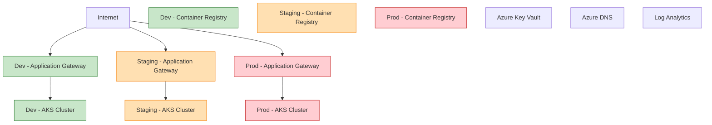

## Core Components

### Infrastructure Layer (Terraform-Managed)

#### **Networking**

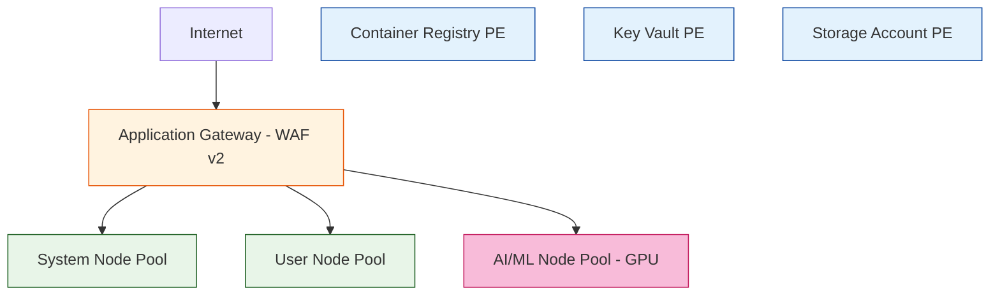

#### **Compute**
- **AKS Cluster**: Multi-node pool architecture
  - **System Pool**: `Standard_D2s_v3` (2-10 nodes)
  - **User Pool**: `Standard_D2s_v3` (1-10 nodes)  
  - **AI/ML Pool**: `Standard_NC6s_v3` (0-2 nodes, GPU-enabled)

#### **Storage & Data**
- **Azure Container Registry**: Premium tier with private endpoints
- **Azure Key Vault**: Certificate and secret management
- **Storage Accounts**: Terraform state and application data
- **Persistent Volumes**: Azure Disk CSI driver

#### **Security**
- **Azure Active Directory**: Identity and access management
- **Network Security Groups**: Traffic filtering
- **Private Endpoints**: Secure connectivity
- **Application Gateway WAF**: Web application firewall

### Platform Layer (Helm-Managed)

#### **GitOps Platform**

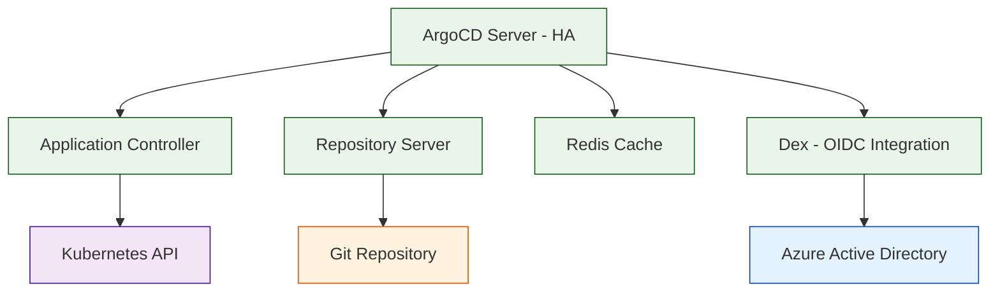

#### **Monitoring Stack**

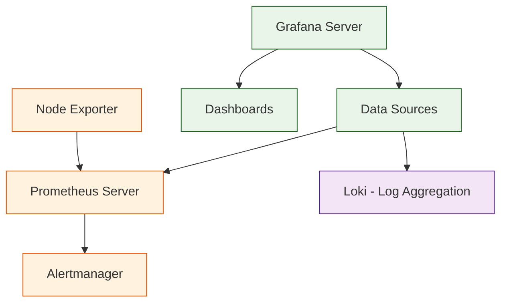

#### **AI/ML Platform**

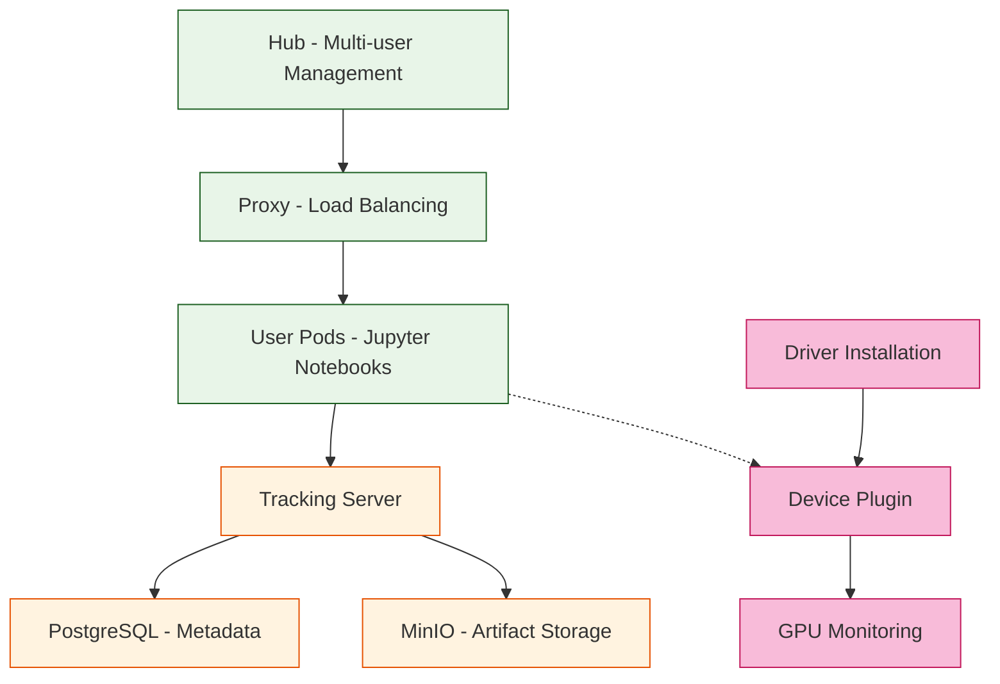

## Design Principles

### **Infrastructure as Code**
- **Declarative Configuration**: All infrastructure defined in Terraform
- **Version Control**: Infrastructure changes tracked in Git
- **Environment Parity**: Consistent configuration across environments
- **Modular Design**: Reusable Terraform modules

### **GitOps Methodology**
- **Git as Source of Truth**: All configurations stored in Git
- **Automated Deployment**: ArgoCD manages application lifecycle
- **Continuous Reconciliation**: Automatic drift detection and correction
- **Audit Trail**: Complete history of changes

### **Security by Design**
- **Zero Trust Network**: Private endpoints and network segmentation
- **Least Privilege Access**: RBAC and minimal permissions
- **Encryption Everywhere**: Data encrypted at rest and in transit
- **Secret Management**: Azure Key Vault integration

### **Observability First**
- **Comprehensive Monitoring**: Metrics, logs, and traces
- **Proactive Alerting**: Early detection of issues
- **Performance Optimization**: Resource utilization tracking
- **Business Metrics**: Application-specific KPIs

## Data Flow Architecture

### **CI/CD Pipeline Flow**

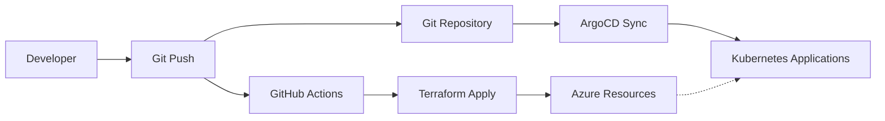

### **Application Deployment Flow**

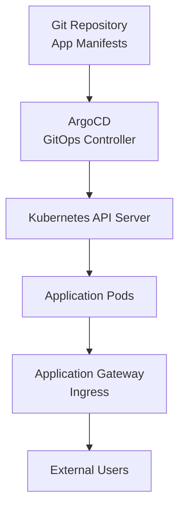

### **Monitoring Data Flow**

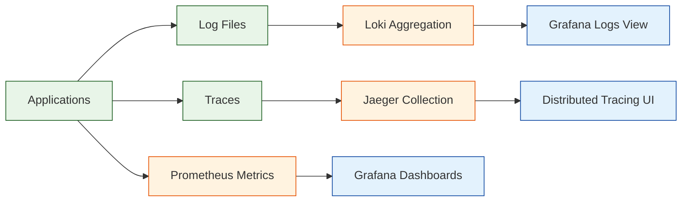

## Network Architecture

### **Traffic Flow**

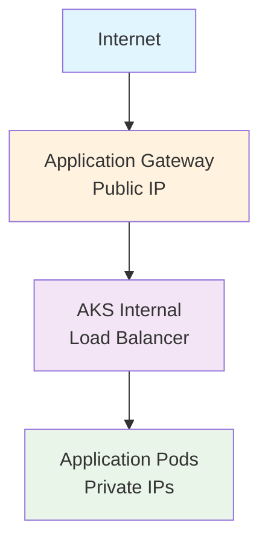

### **Security Zones**
- **DMZ Zone**: Application Gateway subnet
- **Compute Zone**: AKS cluster subnet
- **Data Zone**: Private endpoints subnet
- **Management Zone**: Bastion/jump box (optional)

## Scalability Design

### **Horizontal Scaling**
- **AKS Node Pools**: Auto-scaling based on demand
- **Application Pods**: HPA (Horizontal Pod Autoscaler)
- **Database Connections**: Connection pooling
- **Load Distribution**: Multiple availability zones

### **Vertical Scaling**
- **Resource Limits**: CPU and memory constraints
- **Storage Expansion**: Dynamic volume provisioning
- **Performance Tiers**: Premium storage for critical workloads

## High Availability

### **Infrastructure HA**
- **Multi-Zone Deployment**: Availability zones for resilience
- **Load Balancing**: Traffic distribution across nodes
- **Backup Strategy**: Automated backups for stateful services
- **Disaster Recovery**: Cross-region replication (optional)

### **Application HA**
- **Pod Disruption Budgets**: Maintain minimum replicas
- **Health Checks**: Liveness and readiness probes
- **Circuit Breakers**: Fault tolerance patterns
- **Graceful Shutdown**: Proper termination handling

## Security Architecture

### **Identity and Access**

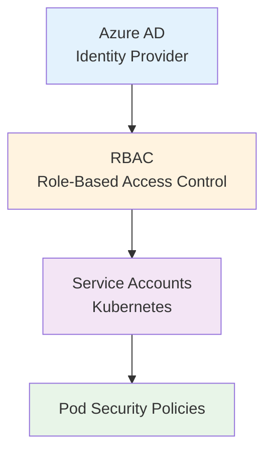

### **Network Security**

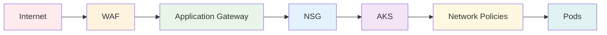

### **Data Protection**
- **Encryption at Rest**: Azure Disk Encryption
- **Encryption in Transit**: TLS 1.2+ everywhere
- **Secret Management**: Azure Key Vault CSI driver
- **Certificate Management**: cert-manager with Let's Encrypt

## Performance Considerations

### **Resource Optimization**
- **Right-Sizing**: Appropriate resource requests/limits
- **Caching Strategy**: Redis for session data
- **CDN Integration**: Static content delivery
- **Database Optimization**: Connection pooling and indexing

### **Monitoring and Alerting**
- **SLI/SLO Definition**: Service level objectives
- **Performance Metrics**: Response time, throughput, error rate
- **Capacity Planning**: Resource utilization trends
- **Cost Optimization**: Resource usage analysis

## Technology Stack

### **Infrastructure**
- **Cloud Provider**: Microsoft Azure
- **Container Orchestration**: Azure Kubernetes Service (AKS)
- **Infrastructure as Code**: Terraform
- **CI/CD**: GitHub Actions

### **Platform Services**
- **GitOps**: ArgoCD
- **Monitoring**: Prometheus + Grafana
- **Logging**: Loki
- **Tracing**: Jaeger (optional)
- **Service Mesh**: Istio (optional)

### **AI/ML Stack**
- **Notebooks**: JupyterHub
- **ML Lifecycle**: MLflow
- **GPU Computing**: NVIDIA GPU Operator
- **Model Serving**: Kubeflow (optional)

## Future Considerations

### **Planned Enhancements**
- **Service Mesh**: Istio for advanced traffic management
- **Multi-Cluster**: Federation across regions
- **Advanced AI/ML**: Kubeflow Pipelines integration
- **Compliance**: Additional security frameworks

### **Scalability Roadmap**
- **Global Load Balancing**: Azure Front Door
- **Edge Computing**: Azure IoT Edge integration
- **Hybrid Cloud**: Azure Arc for on-premises
- **Serverless**: Azure Container Instances integration

This architecture provides a solid foundation for modern cloud-native applications while maintaining flexibility for future growth and requirements.
