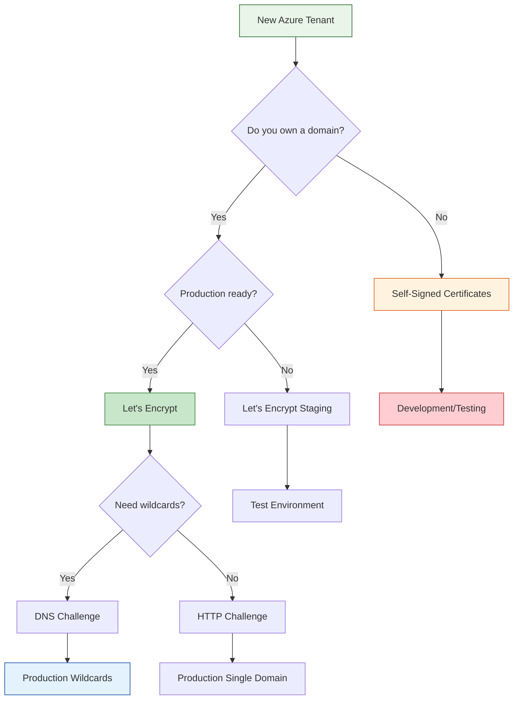

# Certificate Management Guide for Greenfield Deployments

This guide helps you choose and configure the right certificate management approach for your Azure AKS GitOps platform deployment.

## Certificate Options Overview



## Option 1: Let's Encrypt (Recommended for Production)

### When to Choose Let's Encrypt
- You own a domain name
- Domain has public DNS records
- Need automatic certificate renewal
- Production or staging environments
- Want industry-standard SSL certificates

### Prerequisites
- Domain name ownership
- DNS management access (for DNS challenges)
- Public internet access for ACME challenges
- Email address for Let's Encrypt notifications

### Configuration Steps

#### Step 1: Basic Let's Encrypt Setup
Create/update `terraform/environments/dev/terraform.tfvars`:

```hcl
# Enable cert-manager
enable_cert_manager = true

# Let's Encrypt configuration
letsencrypt_email = "admin@yourdomain.com"
enable_letsencrypt_staging = true   # Start with staging
enable_letsencrypt_prod = false     # Enable after testing

# Domain configuration
ssl_certificate_subject = "dev.yourdomain.com"
ssl_certificate_dns_names = ["dev.yourdomain.com"]

# Disable demo certificates
create_demo_ssl_certificate = false
```

#### Step 2: Test with Staging Environment
Deploy with staging configuration first:

```bash
# Deploy infrastructure
terraform apply -var-file="terraform.tfvars"

# Verify cert-manager is running
kubectl get pods -n cert-manager

# Check certificate request
kubectl get certificaterequests -A
kubectl get certificates -A

# Verify staging certificate
kubectl describe certificate -n default
```

#### Step 3: Switch to Production
After successful staging validation:

```hcl
# Update terraform.tfvars
enable_letsencrypt_staging = false
enable_letsencrypt_prod = true
```

#### Step 4: Wildcard Certificate Setup
For wildcard certificates (*.yourdomain.com):

```hcl
# DNS challenge required for wildcards
ssl_certificate_dns_names = ["yourdomain.com", "*.yourdomain.com"]
cert_manager_dns_challenge_provider = "azure"  # or "cloudflare", "route53"

# Azure DNS configuration (if using Azure DNS)
azure_dns_zone_resource_group = "your-dns-rg"
azure_dns_zone_name = "yourdomain.com"
```

### Validation Steps

#### Verify Certificate Issuance
```bash
# Check certificate status
kubectl get certificates -A

# View certificate details
kubectl describe certificate your-cert-name -n default

# Check cert-manager logs
kubectl logs -n cert-manager deployment/cert-manager

# Verify ACME challenge
kubectl get challenges -A
```

#### Test SSL Configuration
```bash
# Get AGC frontend FQDN
terraform output agc_frontend_fqdn

# Test SSL certificate
openssl s_client -connect your-domain.com:443 -servername your-domain.com

# Verify certificate chain
curl -vI https://your-domain.com
```

## Option 2: Self-Signed Certificates (Development Only)

### When to Choose Self-Signed
- Development and testing environments
- No domain name available
- Proof of concept deployments
- Internal/private environments
- NOT for production use

### Configuration
```hcl
# Enable demo SSL certificate
create_demo_ssl_certificate = true

# Disable cert-manager
enable_cert_manager = false

# Demo certificate configuration
ssl_certificate_subject = "aks-demo.local"
ssl_certificate_dns_names = ["aks-demo.local", "*.aks-demo.local"]
```

### Accessing Services with Self-Signed Certificates
```bash
# Get AGC frontend FQDN and resolve to IP
terraform output agc_frontend_fqdn
nslookup $(terraform output -raw agc_frontend_fqdn)

# Add to /etc/hosts (Linux/macOS) or C:\Windows\System32\drivers\etc\hosts (Windows)
<AGC_IP> aks-demo.local argocd.aks-demo.local grafana.aks-demo.local

# Access services (accept certificate warnings in browser)
https://argocd.aks-demo.local
https://grafana.aks-demo.local
```

## Option 3: Wildcard Certificates (Enterprise)

### When to Choose Wildcard Certificates
- Multiple subdomains needed
- Enterprise PKI infrastructure
- Offline or air-gapped environments
- Existing certificate management processes

### Manual Wildcard Certificate Setup

#### Step 1: Generate Certificate Request
```bash
# Create private key
openssl genrsa -out wildcard.key 2048

# Create certificate signing request
openssl req -new -key wildcard.key -out wildcard.csr \
  -subj "/CN=*.yourdomain.com/O=Your Organization/C=US"
```

#### Step 2: Obtain Certificate from CA
- Submit CSR to your certificate authority
- Download the signed certificate and intermediate certificates
- Combine into full certificate chain

#### Step 3: Import to Azure Key Vault
```bash
# Convert to PFX format
openssl pkcs12 -export -out wildcard.pfx \
  -inkey wildcard.key \
  -in wildcard.crt \
  -certfile intermediate.crt

# Import to Key Vault
az keyvault certificate import \
  --vault-name kv-your-project-dev \
  --name wildcard-cert \
  --file wildcard.pfx
```

#### Step 4: Configure Terraform
```hcl
# Use existing certificate
create_demo_ssl_certificate = false
enable_cert_manager = false

# Reference Key Vault certificate
ssl_certificate_key_vault_secret_id = "https://kv-your-project-dev.vault.azure.net/secrets/wildcard-cert"
```

## DNS Configuration

### Azure DNS Integration
If using Azure DNS for your domain:

```hcl
# Enable Azure DNS integration
enable_azure_dns = true
azure_dns_zone_resource_group = "your-dns-rg"
azure_dns_zone_name = "yourdomain.com"

# Automatic DNS record creation
create_dns_records = true
```

### External DNS Providers
For external DNS providers (Cloudflare, Route53, etc.):

1. **Manual DNS Configuration**: Create CNAME records pointing to AGC frontend FQDN
2. **External DNS Controller**: Deploy external-dns for automatic record management
3. **DNS Challenge**: Configure cert-manager with DNS provider credentials

## Certificate Renewal

### Automatic Renewal (Let's Encrypt)
- cert-manager handles automatic renewal
- Certificates renewed 30 days before expiration
- No manual intervention required

### Manual Renewal (Wildcard/Enterprise)
```bash
# Check certificate expiration
kubectl get certificates -A -o custom-columns=NAME:.metadata.name,READY:.status.conditions[0].status,EXPIRY:.status.notAfter

# Manual renewal process
# 1. Generate new CSR
# 2. Obtain new certificate from CA
# 3. Update Key Vault certificate
# 4. Restart Application Gateway if needed
```

## Troubleshooting Certificate Issues

### Common Let's Encrypt Issues

#### ACME Challenge Failures
```bash
# Check challenge status
kubectl get challenges -A

# View challenge details
kubectl describe challenge challenge-name -n namespace

# Check cert-manager logs
kubectl logs -n cert-manager deployment/cert-manager
```

#### DNS Challenge Issues
```bash
# Verify DNS propagation
dig TXT _acme-challenge.yourdomain.com

# Check DNS provider credentials
kubectl get secret -n cert-manager
```

### AGC Certificate Issues

#### Certificate Not Loading
```bash
# Check Gateway configuration
kubectl get gateway -A -o yaml

# Check certificate secrets
kubectl get secrets -A | grep tls

# Verify cert-manager certificates
kubectl get certificates -A
kubectl describe certificate your-cert-name -n your-namespace

# Check ALB Controller logs
kubectl logs -n azure-alb-system -l app=alb-controller
```

#### SSL Handshake Failures
```bash
# Test SSL connection
openssl s_client -connect yourdomain.com:443 -servername yourdomain.com

# Check certificate chain
curl -vI https://yourdomain.com

# Verify certificate validity
echo | openssl s_client -connect yourdomain.com:443 2>/dev/null | openssl x509 -noout -dates
```

## Security Best Practices

### Certificate Security
- Use strong private keys (2048-bit RSA minimum)
- Protect private keys with appropriate access controls
- Regularly rotate certificates and keys
- Monitor certificate expiration dates

### Key Vault Security
- Enable Key Vault firewall
- Use managed identities for access
- Enable audit logging
- Implement least-privilege access

### Network Security
- Use private endpoints for Key Vault
- Implement network security groups
- Configure AGC for secure traffic handling
- Monitor certificate-related traffic

## Cost Considerations

### Let's Encrypt
- **Cost**: Free certificates
- **Operational**: Minimal (automated)
- **Bandwidth**: ACME challenge traffic

### Enterprise Certificates
- **Cost**: Certificate authority fees
- **Operational**: Manual renewal processes
- **Management**: Additional tooling and processes

### Azure Services
- **Key Vault**: $0.03 per 10,000 operations
- **Application Gateway for Containers**: Standard pricing
- **DNS**: $0.50 per hosted zone per month

## Migration Strategies

### From Self-Signed to Let's Encrypt
1. Obtain domain name
2. Configure DNS records
3. Update Terraform configuration
4. Deploy with Let's Encrypt staging
5. Test thoroughly
6. Switch to production Let's Encrypt

### From Manual to Automated
1. Deploy cert-manager
2. Configure ACME issuer
3. Create certificate resources
4. Verify automatic issuance
5. Remove manual certificates

This guide provides comprehensive coverage of certificate management options for your greenfield Azure deployment. Choose the approach that best fits your requirements, security posture, and operational capabilities.
