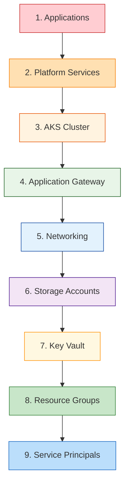

# Infrastructure Cleanup Guide

This guide provides comprehensive instructions for safely removing all infrastructure deployed by the Azure AKS GitOps platform project.

## Important Warnings

### **Data Loss Warning**
- **ALL DATA WILL BE PERMANENTLY DELETED**
- This includes databases, persistent volumes, certificates, and configurations
- **BACKUP ANY IMPORTANT DATA BEFORE PROCEEDING**

### **Cost Impact**
- Some resources may have minimum billing periods
- Storage accounts may retain data for compliance (soft delete)
- Review your Azure bill after cleanup to ensure all resources are removed

### **Dependencies**
- Applications deployed via ArgoCD must be removed first
- Some Azure resources have dependencies that require specific deletion order

## Cleanup Methods

### Method 1: Automated Pipeline Cleanup (Recommended)

Use GitHub Actions to safely destroy all infrastructure in the correct order.

#### Step 1: Trigger Destroy Pipeline
```bash
# Option A: Via GitHub CLI
gh workflow run terraform-deploy.yml \
  -f environment=dev \
  -f action=destroy

# Option B: Via GitHub Web UI
# 1. Go to Actions → Terraform Deploy
# 2. Click "Run workflow"
# 3. Select environment: dev/staging/prod
# 4. Select action: destroy
# 5. Click "Run workflow"
```

#### Step 2: Monitor Destruction Progress
1. Go to GitHub Actions → Terraform Deploy workflow
2. Monitor the destroy process (typically 10-20 minutes)
3. Check for any failures or stuck resources
4. Repeat for all environments (dev, staging, prod)

#### Step 3: Verify Cleanup
```bash
# Check remaining resources
az resource list --resource-group rg-your-project-dev --output table
az resource list --resource-group rg-your-project-staging --output table
az resource list --resource-group rg-your-project-prod --output table
```

### Method 2: Manual Terraform Cleanup

For manual control over the destruction process.

#### Step 1: Prepare Environment
```bash
# Navigate to environment directory
cd terraform/environments/dev

# Initialize Terraform (if not already done)
terraform init

# Verify current state
terraform plan -destroy -var-file="terraform.tfvars"
```

#### Step 2: Destroy Infrastructure
```bash
# Destroy all resources
terraform destroy -var-file="terraform.tfvars" -auto-approve

# If destruction fails, try force removal
terraform destroy -var-file="terraform.tfvars" -auto-approve -refresh=false
```

#### Step 3: Clean Terraform State
```bash
# Remove local state files
rm -f terraform.tfstate*
rm -f .terraform.lock.hcl
rm -rf .terraform/

# Clean backend state (if using remote backend)
terraform init -reconfigure
```

#### Step 4: Repeat for All Environments
```bash
# Staging environment
cd ../staging
terraform destroy -var-file="terraform.tfvars" -auto-approve

# Production environment
cd ../prod
terraform destroy -var-file="terraform.tfvars" -auto-approve
```

### Method 3: Manual Azure Resource Cleanup

When Terraform cleanup fails or for emergency cleanup.

#### Step 1: Remove Resource Groups
```bash
# List all project resource groups
az group list --query "[?contains(name, 'your-project')].name" -o table

# Delete main resource groups (THIS DELETES EVERYTHING)
az group delete --name rg-your-project-dev --yes --no-wait
az group delete --name rg-your-project-staging --yes --no-wait
az group delete --name rg-your-project-prod --yes --no-wait

# Delete Terraform state resource group
az group delete --name your-project-terraform-state-rg --yes --no-wait
```

#### Step 2: Remove Service Principals
```bash
# List project service principals
az ad sp list --display-name "your-project" --query "[].{Name:displayName,AppId:appId}" -o table

# Delete service principals
az ad sp delete --id $(az ad sp list --display-name "your-project-terraform-sp" --query "[0].appId" -o tsv)
az ad sp delete --id $(az ad sp list --display-name "your-project-github-actions-sp" --query "[0].appId" -o tsv)
```

#### Step 3: Clean DNS Records (if using Azure DNS)
```bash
# List DNS zones
az network dns zone list --query "[?contains(name, 'yourdomain')].name" -o table

# Delete DNS records (if created by the project)
az network dns record-set a delete --resource-group your-dns-rg --zone-name yourdomain.com --name "@" --yes
az network dns record-set a delete --resource-group your-dns-rg --zone-name yourdomain.com --name "*" --yes
```

## Cleanup Order and Dependencies

### Recommended Destruction Order



### Manual Step-by-Step Cleanup

#### Step 1: Remove Applications
```bash
# Get AKS credentials
az aks get-credentials --resource-group rg-your-project-dev --name aks-your-project-dev

# Remove ArgoCD applications
kubectl delete applications --all -n argocd

# Remove application namespaces
kubectl delete namespace app1 app2 app3  # Replace with your app namespaces
```

#### Step 2: Remove Platform Services
```bash
# Remove monitoring stack
kubectl delete namespace monitoring

# Remove AI/ML tools
kubectl delete namespace ai-tools

# Remove ArgoCD
kubectl delete namespace argocd

# Remove cert-manager
kubectl delete namespace cert-manager
```

#### Step 3: Remove AKS Cluster
```bash
# Delete AKS cluster
az aks delete --resource-group rg-your-project-dev --name aks-your-project-dev --yes --no-wait
```

#### Step 4: Remove Application Gateway
```bash
# Delete Application Gateway
az network application-gateway delete --resource-group rg-your-project-dev --name agw-your-project-dev
```

#### Step 5: Remove Networking
```bash
# Delete virtual network (this removes all subnets)
az network vnet delete --resource-group rg-your-project-dev --name vnet-your-project-dev
```

#### Step 6: Remove Storage and Key Vault
```bash
# Delete Key Vault (with purge protection)
az keyvault delete --name kv-your-project-dev
az keyvault purge --name kv-your-project-dev

# Delete storage accounts
az storage account delete --name styourprojectdev --yes
```

## Troubleshooting Cleanup Issues

### Common Cleanup Problems

#### Stuck AKS Cluster Deletion
```bash
# Force delete AKS cluster
az aks delete --resource-group rg-your-project-dev --name aks-your-project-dev --yes --no-wait

# If still stuck, delete the underlying VM scale sets
az vmss list --resource-group MC_rg-your-project-dev_aks-your-project-dev_eastus --output table
az vmss delete --resource-group MC_rg-your-project-dev_aks-your-project-dev_eastus --name aks-nodepool1-vmss
```

#### Application Gateway Won't Delete
```bash
# Check for remaining backend pools or rules
az network application-gateway show --resource-group rg-your-project-dev --name agw-your-project-dev

# Force delete
az network application-gateway delete --resource-group rg-your-project-dev --name agw-your-project-dev --no-wait
```

#### Key Vault Soft Delete Issues
```bash
# List deleted Key Vaults
az keyvault list-deleted

# Purge deleted Key Vault
az keyvault purge --name kv-your-project-dev --location eastus
```

#### Persistent Volume Claims
```bash
# List PVCs that might prevent deletion
kubectl get pvc --all-namespaces

# Force delete stuck PVCs
kubectl patch pvc pvc-name -p '{"metadata":{"finalizers":null}}'
kubectl delete pvc pvc-name --force --grace-period=0
```

#### Network Security Group Dependencies
```bash
# Check NSG associations
az network nsg list --resource-group rg-your-project-dev --query "[].{Name:name,Subnets:subnets[].id}" -o table

# Remove NSG associations before deletion
az network vnet subnet update --resource-group rg-your-project-dev --vnet-name vnet-your-project-dev --name subnet-name --network-security-group ""
```

### Force Cleanup Script

Create an emergency cleanup script for stuck resources:

```bash
#!/bin/bash
# emergency-cleanup.sh

PROJECT_NAME="your-project"
ENVIRONMENTS=("dev" "staging" "prod")

echo "EMERGENCY CLEANUP - THIS WILL DELETE EVERYTHING"
read -p "Are you sure? Type 'DELETE EVERYTHING' to continue: " confirmation

if [ "$confirmation" != "DELETE EVERYTHING" ]; then
    echo "Cleanup cancelled"
    exit 1
fi

for env in "${ENVIRONMENTS[@]}"; do
    echo "Cleaning up $env environment..."
    
    # Force delete resource group
    az group delete --name "rg-${PROJECT_NAME}-${env}" --yes --no-wait --force-deletion-types Microsoft.Compute/virtualMachineScaleSets
    
    # Delete managed cluster resource group
    az group delete --name "MC_rg-${PROJECT_NAME}-${env}_aks-${PROJECT_NAME}-${env}_eastus" --yes --no-wait
done

# Delete Terraform state
az group delete --name "${PROJECT_NAME}-terraform-state-rg" --yes --no-wait

# Delete service principals
az ad sp delete --id $(az ad sp list --display-name "${PROJECT_NAME}-terraform-sp" --query "[0].appId" -o tsv) 2>/dev/null
az ad sp delete --id $(az ad sp list --display-name "${PROJECT_NAME}-github-actions-sp" --query "[0].appId" -o tsv) 2>/dev/null

echo "Emergency cleanup initiated. Check Azure portal in 10-15 minutes."
```

## Post-Cleanup Verification

### Verify Complete Removal
```bash
# Check for remaining resources
az resource list --query "[?contains(resourceGroup, 'your-project')]" -o table

# Check for remaining resource groups
az group list --query "[?contains(name, 'your-project')]" -o table

# Check for remaining service principals
az ad sp list --display-name "your-project" --query "[].displayName" -o table

# Check for remaining Key Vaults (including soft-deleted)
az keyvault list-deleted --query "[?contains(name, 'your-project')]" -o table
```

### Clean Local Environment
```bash
# Remove local Terraform state
rm -rf terraform/environments/*/terraform.tfstate*
rm -rf terraform/environments/*/.terraform/
rm -rf terraform/environments/*/.terraform.lock.hcl

# Remove local credentials
rm -f .env
rm -f azure-credentials.json

# Remove kubectl contexts
kubectl config delete-context aks-your-project-dev
kubectl config delete-context aks-your-project-staging
kubectl config delete-context aks-your-project-prod
```

### GitHub Cleanup
```bash
# Remove GitHub secrets (optional)
gh secret delete ARM_CLIENT_ID
gh secret delete ARM_CLIENT_SECRET
gh secret delete ARM_SUBSCRIPTION_ID
gh secret delete ARM_TENANT_ID

# Remove GitHub environments (manual via web UI)
# Go to Settings → Environments → Delete each environment
```

## Cost Verification

### Check Final Costs
1. **Azure Cost Management**: Review costs for the past 30 days
2. **Resource Groups**: Ensure all project resource groups are deleted
3. **Hidden Costs**: Check for remaining storage, networking, or compute charges
4. **Billing Alerts**: Set up alerts for unexpected charges

### Common Missed Resources
- **Log Analytics Workspaces**: May be in different resource groups
- **Application Insights**: Often in separate resource groups
- **Storage Account Soft Delete**: May retain data for 7-90 days
- **Key Vault Soft Delete**: Retains vault for 90 days by default
- **Public IP Addresses**: May be orphaned after resource deletion

## Recovery Options

### If You Need to Restore
- **Terraform State**: Restore from backup if available
- **Application Data**: Restore from backups (if configured)
- **Certificates**: Re-issue from Let's Encrypt or certificate authority
- **DNS Records**: Reconfigure DNS settings

### Partial Cleanup
If you only want to remove specific environments:
```bash
# Remove only dev environment
terraform destroy -var-file="terraform.tfvars" -target="module.dev"

# Remove only specific resources
terraform destroy -var-file="terraform.tfvars" -target="azurerm_kubernetes_cluster.main"
```

## Quick Reference

### Fast Cleanup (Automated)
```bash
# Run the automated cleanup script
./scripts/cleanup-infrastructure.sh --project-name "your-project" --yes
```

### Emergency Cleanup (Force Delete Everything)
```bash
# For when normal cleanup fails
./scripts/cleanup-infrastructure.sh --project-name "your-project" --force --yes
```

### Manual Cleanup Commands
```bash
# Delete resource groups (nuclear option)
az group delete --name rg-your-project-dev --yes --no-wait
az group delete --name rg-your-project-staging --yes --no-wait
az group delete --name rg-your-project-prod --yes --no-wait
az group delete --name your-project-terraform-state-rg --yes --no-wait

# Delete service principals
az ad sp delete --id $(az ad sp list --display-name "your-project-terraform-sp" --query "[0].appId" -o tsv)
az ad sp delete --id $(az ad sp list --display-name "your-project-github-actions-sp" --query "[0].appId" -o tsv)
```

### Verification Commands
```bash
# Check for remaining resources
az resource list --query "[?contains(resourceGroup, 'your-project')]" -o table
az group list --query "[?contains(name, 'your-project')]" -o table
az ad sp list --display-name "your-project" --query "[].displayName" -o table
```

This cleanup guide ensures complete removal of all infrastructure while providing troubleshooting steps for common issues. Always verify complete cleanup to avoid unexpected costs.
