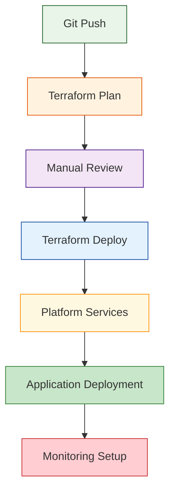

# Pipeline-Based Deployment Guide

This guide explains how to deploy the Azure AKS GitOps platform using GitHub Actions pipelines for a completely automated deployment experience.

## Overview

The project includes comprehensive GitHub Actions workflows that can deploy the entire platform automatically:

- **Infrastructure deployment** via Terraform
- **Platform services** via Helm and Kubernetes manifests
- **Application deployment** via ArgoCD
- **Monitoring and alerting** setup
- **Certificate management** configuration

## Pipeline Architecture



## Prerequisites

### 1. GitHub Repository Setup
- Fork or clone this repository to your GitHub account
- Ensure GitHub Actions are enabled
- You have admin access to configure secrets and environments

### 2. Azure Prerequisites
- Azure subscription with appropriate permissions
- Azure CLI installed locally for initial setup

### 3. Local Tools (for initial setup only)
- GitHub CLI (`gh`) for automated secret configuration
- Bash shell for running setup scripts

## Step-by-Step Pipeline Deployment

### Step 1: Initial Azure Configuration

Run the automated setup scripts to configure Azure resources and credentials:

```bash
# Clone the repository
git clone git@github.com:cmcconnell1/aks-platform.git
cd aks-platform

# Make scripts executable
chmod +x scripts/*.sh scripts/*.py

# Login to Azure
az login
az account set --subscription "your-subscription-id"

# Run automated Azure setup
./scripts/setup-azure-credentials.sh --project-name "your-project" --location "East US"
```

This script will:
- Create Azure service principals with appropriate permissions
- Set up storage accounts for Terraform state management
- Generate backend configuration files
- Create resource groups and security configurations

### Step 2: Configure GitHub Secrets

Automate GitHub repository secret configuration:

```bash
# Login to GitHub CLI
gh auth login

# Run automated GitHub secrets setup
./scripts/setup-github-secrets.sh
```

This will configure the following secrets:
- `ARM_CLIENT_ID` - Azure service principal ID
- `ARM_CLIENT_SECRET` - Azure service principal secret
- `ARM_SUBSCRIPTION_ID` - Azure subscription ID
- `ARM_TENANT_ID` - Azure tenant ID
- `TF_BACKEND_STORAGE_ACCOUNT` - Terraform state storage account
- `TF_BACKEND_CONTAINER` - Terraform state container name

### Step 3: Configure Deployment Variables

Create environment-specific configuration files:

#### For Development Environment
Create `terraform/environments/dev/terraform.tfvars`:

```hcl
# Project Configuration
project_name = "your-project-name"
location = "East US"
environment = "dev"

# Certificate Management - Choose your approach
# Option A: Let's Encrypt (recommended for real domains)
enable_cert_manager = true
letsencrypt_email = "admin@yourdomain.com"
enable_letsencrypt_staging = true
ssl_certificate_subject = "dev.yourdomain.com"
ssl_certificate_dns_names = ["dev.yourdomain.com", "*.dev.yourdomain.com"]

# Option B: Self-signed certificates (for testing)
# create_demo_ssl_certificate = true

# Platform Features
enable_ai_tools = true
enable_gpu_node_pool = false
enable_monitoring = true
enable_grafana = true

# Networking
vnet_address_space = ["10.0.0.0/16"]
aks_subnet_address_prefix = "10.0.1.0/24"
appgw_subnet_address_prefix = "10.0.2.0/24"

# AKS Configuration
kubernetes_version = "1.28"
system_node_pool_vm_size = "Standard_D2s_v3"
user_node_pool_vm_size = "Standard_D2s_v3"
```

#### For Staging Environment
Create `terraform/environments/staging/terraform.tfvars`:

```hcl
# Copy dev configuration and modify:
project_name = "your-project-name"
environment = "staging"
ssl_certificate_subject = "staging.yourdomain.com"
ssl_certificate_dns_names = ["staging.yourdomain.com", "*.staging.yourdomain.com"]
enable_letsencrypt_staging = false  # Use production Let's Encrypt
enable_letsencrypt_prod = true
```

#### For Production Environment
Create `terraform/environments/prod/terraform.tfvars`:

```hcl
# Production configuration with enhanced settings:
project_name = "your-project-name"
environment = "prod"
ssl_certificate_subject = "yourdomain.com"
ssl_certificate_dns_names = ["yourdomain.com", "*.yourdomain.com"]
enable_letsencrypt_prod = true

# Production-grade sizing
system_node_pool_vm_size = "Standard_D4s_v3"
user_node_pool_vm_size = "Standard_D4s_v3"
system_node_pool_node_count = 3
user_node_pool_min_count = 2
user_node_pool_max_count = 10

# Enhanced security and monitoring
enable_network_policy = true
enable_azure_policy = true
enable_defender = true
```

### Step 4: Configure GitHub Environments

Set up environment protection rules in GitHub:

1. Go to your repository → Settings → Environments
2. Create environments: `dev`, `staging`, `prod`
3. Configure protection rules:

#### Development Environment
- No protection rules (automatic deployment)

#### Staging Environment
- Require reviewers: 1 person
- Restrict to specific branches: `main`

#### Production Environment
- Require reviewers: 2 people
- Restrict to specific branches: `main`
- Deployment delay: 5 minutes

### Step 5: Deploy via Pipeline

#### Automatic Deployment (Push to Main)
```bash
# Commit your configuration
git add terraform/environments/*/backend.conf
git commit -m "feat: add Azure backend configuration"
git push origin main
```

This triggers the automatic deployment pipeline:
1. Terraform plan runs automatically
2. Infrastructure deploys to dev environment
3. Platform services are configured
4. ArgoCD deploys applications

#### Manual Deployment (Workflow Dispatch)
1. Go to GitHub → Actions → "Terraform Deploy"
2. Click "Run workflow"
3. Select environment: `dev`, `staging`, or `prod`
4. Select action: `apply` or `destroy`
5. Click "Run workflow"

### Step 6: Monitor Deployment Progress

Track deployment progress in GitHub Actions:

1. **Terraform Plan** (2-3 minutes)
   - Validates configuration
   - Shows planned changes
   - Checks for conflicts

2. **Terraform Apply** (15-20 minutes)
   - Creates Azure infrastructure
   - Provisions AKS cluster
   - Configures networking and security

3. **Platform Services** (5-10 minutes)
   - Deploys ArgoCD
   - Sets up monitoring stack
   - Configures certificate management

4. **Application Deployment** (5-10 minutes)
   - ArgoCD syncs applications
   - Configures ingress rules
   - Sets up SSL certificates

### Step 7: Verify Deployment

After successful pipeline execution:

```bash
# Get AKS credentials
az aks get-credentials --resource-group rg-your-project-dev --name aks-your-project-dev

# Verify cluster access
kubectl get nodes

# Check platform services
kubectl get pods -A

# Access ArgoCD UI
kubectl port-forward svc/argocd-server -n argocd 8080:443
# Open https://localhost:8080 (admin/password from kubectl get secret)

# Access Grafana
kubectl port-forward svc/grafana -n monitoring 3000:80
# Open http://localhost:3000 (admin/admin)
```

## Pipeline Features

### Automated Testing
- Terraform validation and formatting checks
- Security scanning with Checkov
- Cost estimation with Infracost
- Drift detection for infrastructure

### Security Features
- Secure secret management via GitHub secrets
- Environment-specific access controls
- Approval workflows for production
- Audit logging of all deployments

### Monitoring and Notifications
- Deployment status notifications
- Cost impact reporting
- Security vulnerability alerts
- Infrastructure drift detection

## Certificate Management in Pipelines

### Let's Encrypt Integration
The pipeline automatically configures Let's Encrypt certificates:

1. **Staging Environment**: Uses Let's Encrypt staging for testing
2. **Production Environment**: Uses Let's Encrypt production
3. **Automatic Renewal**: cert-manager handles renewal automatically
4. **DNS Validation**: Supports both HTTP and DNS challenges

### Wildcard Certificate Support
For wildcard certificates:

1. Upload certificate to Azure Key Vault manually
2. Configure Terraform to reference existing certificate
3. Pipeline will configure Application Gateway to use it

## Troubleshooting Pipeline Issues

### Common Pipeline Failures

#### Authentication Errors
- Verify GitHub secrets are correctly configured
- Check Azure service principal permissions
- Ensure subscription ID is correct

#### Terraform State Issues
- Verify storage account access
- Check backend configuration
- Ensure state file isn't corrupted

#### Resource Quota Issues
- Check Azure subscription quotas
- Request quota increases if needed
- Consider different VM sizes or regions

#### Certificate Issues
- Verify domain ownership for Let's Encrypt
- Check DNS configuration
- Ensure ACME challenge accessibility

### Debugging Steps
1. Check GitHub Actions logs for detailed error messages
2. Review Terraform plan output for configuration issues
3. Verify Azure resource creation in portal
4. Check Kubernetes events for platform service issues

## Cost Management

### Pipeline Cost Optimization
- Automatic resource tagging for cost tracking
- Environment-specific sizing configurations
- Scheduled shutdown for dev environments
- Cost alerts and budgets via Azure

### Estimated Monthly Costs
- **Development**: $200-300/month
- **Staging**: $400-600/month  
- **Production**: $800-1500/month

## Next Steps

After successful pipeline deployment:

1. **Configure DNS** - Point your domain to Application Gateway public IP
2. **Set up monitoring** - Configure Grafana dashboards and alerts
3. **Deploy applications** - Use ArgoCD for application lifecycle management
4. **Security hardening** - Review and implement additional security measures
5. **Backup strategy** - Configure backup for persistent data and configurations
