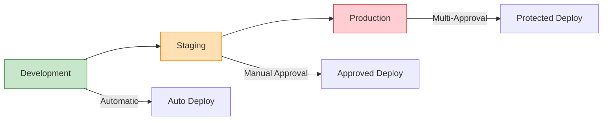

# Production Update Strategy for Monolithic Platform

This guide outlines strategies and safeguards to ensure zero-downtime updates to the Azure AKS GitOps platform in production environments, addressing the challenges of managing a monolithic codebase that includes infrastructure, platform services, and applications.

## Update Strategy Overview

### The Monolithic Challenge

This platform combines multiple concerns in a single repository:
- **Infrastructure** (Terraform modules)
- **Platform services** (ArgoCD, monitoring, AI/ML tools)
- **Application manifests** (GitOps configurations)
- **CI/CD pipelines** (GitHub Actions workflows)

**Risk**: Changes to any component could potentially impact production services.

**Solution**: Multi-layered safety mechanisms and progressive deployment strategies.

## Safety Mechanisms

### 1. Environment Isolation Strategy



#### Environment Protection Rules

**Development Environment**:
- Automatic deployment on merge to main
- No approval required
- Used for initial testing and validation

**Staging Environment**:
- Manual approval required (1 reviewer)
- Production-like configuration
- Full integration testing
- Performance validation

**Production Environment**:
- Multi-person approval required (2+ reviewers)
- Deployment delay (5-minute cooling period)
- Restricted to main branch only
- Comprehensive monitoring and rollback procedures

### 2. Progressive Deployment Pipeline

#### Phase 1: Pre-Deployment Validation
```bash
# Automated checks before any deployment
1. Terraform validation and formatting
2. Security scanning (Checkov, TFSec)
3. Cost impact analysis (Infracost)
4. Dependency vulnerability scanning
5. Configuration drift detection
```

#### Phase 2: Infrastructure Updates (Terraform)
```bash
# Infrastructure changes with safety checks
1. Generate Terraform plan
2. Review resource changes
3. Validate no destructive operations
4. Apply with state locking
5. Verify infrastructure health
```

#### Phase 3: Platform Services Updates
```bash
# Platform service updates with rolling deployment
1. Update Helm chart versions
2. Deploy to staging first
3. Validate service health
4. Progressive rollout to production
5. Monitor service metrics
```

#### Phase 4: Application Updates (ArgoCD)
```bash
# Application updates via GitOps
1. Update application manifests
2. ArgoCD sync policies control rollout
3. Health checks and readiness probes
4. Automatic rollback on failure
```

### 3. Change Impact Analysis

#### Infrastructure Changes (High Risk)
- **AKS cluster modifications**: Node pool changes, networking updates
- **AGC changes**: Gateway resources, HTTPRoute configurations, TLS settings
- **Storage modifications**: Persistent volume changes
- **Security updates**: RBAC, network policies

**Safety Measures**:
- Mandatory staging validation
- Blue-green deployment for critical components
- Backup verification before changes
- Rollback procedures documented and tested

#### Platform Service Changes (Medium Risk)
- **ArgoCD updates**: GitOps controller changes
- **Monitoring stack**: Prometheus, Grafana updates
- **AI/ML tools**: JupyterHub, MLflow updates

**Safety Measures**:
- Rolling updates with health checks
- Service mesh traffic shifting (if enabled)
- Canary deployments for critical services
- Automated rollback triggers

#### Application Changes (Lower Risk)
- **Application manifests**: Deployment configurations
- **ConfigMaps and Secrets**: Configuration updates
- **Ingress rules**: Traffic routing changes

**Safety Measures**:
- ArgoCD sync policies
- Progressive sync strategies
- Health check validation
- Immediate rollback capability

## Deployment Strategies by Component Type

### 1. Infrastructure Updates (Terraform)

#### Blue-Green Infrastructure Strategy
```hcl
# Example: AKS node pool blue-green update
resource "azurerm_kubernetes_cluster_node_pool" "blue" {
  count = var.active_pool == "blue" ? 1 : 0
  # Blue pool configuration
}

resource "azurerm_kubernetes_cluster_node_pool" "green" {
  count = var.active_pool == "green" ? 1 : 0
  # Green pool configuration
}
```

#### Rolling Update Strategy
```bash
# For non-disruptive updates
1. Create new resources alongside existing
2. Migrate workloads gradually
3. Validate functionality
4. Remove old resources
5. Update DNS/routing if needed
```

### 2. Platform Services Updates

#### Helm Chart Rolling Updates
```yaml
# ArgoCD Application with rolling update strategy
apiVersion: argoproj.io/v1alpha1
kind: Application
metadata:
  name: monitoring-stack
spec:
  syncPolicy:
    automated:
      prune: true
      selfHeal: true
    syncOptions:
    - CreateNamespace=true
    - RespectIgnoreDifferences=true
  revisionHistoryLimit: 10
```

#### Service Mesh Traffic Shifting (Optional)
```yaml
# Istio VirtualService for canary deployment
apiVersion: networking.istio.io/v1beta1
kind: VirtualService
spec:
  http:
  - match:
    - headers:
        canary:
          exact: "true"
    route:
    - destination:
        host: service-v2
  - route:
    - destination:
        host: service-v1
      weight: 90
    - destination:
        host: service-v2
      weight: 10
```

### 3. Application Updates (GitOps)

#### ArgoCD Sync Strategies
```yaml
# Progressive sync with health checks
apiVersion: argoproj.io/v1alpha1
kind: Application
spec:
  syncPolicy:
    automated:
      prune: false  # Manual pruning for safety
      selfHeal: false  # Manual healing for control
    retry:
      limit: 3
      backoff:
        duration: 5s
        factor: 2
        maxDuration: 3m
```

## Monitoring and Alerting During Updates

### 1. Pre-Update Health Baseline
```bash
# Establish baseline metrics before updates
kubectl top nodes
kubectl get pods --all-namespaces -o wide
kubectl get events --sort-by='.lastTimestamp'

# AGC and Gateway health
kubectl get gateway -A
kubectl get httproutes -A

# Service health checks
curl -f https://your-domain.com/health
```

### 2. Real-Time Monitoring During Updates
```yaml
# Prometheus alerts for deployment issues
groups:
- name: deployment.rules
  rules:
  - alert: DeploymentReplicasMismatch
    expr: kube_deployment_status_replicas != kube_deployment_spec_replicas
    for: 5m
    labels:
      severity: warning
    annotations:
      summary: "Deployment has mismatched replicas"

  - alert: PodCrashLooping
    expr: rate(kube_pod_container_status_restarts_total[15m]) > 0
    for: 5m
    labels:
      severity: critical
    annotations:
      summary: "Pod is crash looping"
```

### 3. Post-Update Validation
```bash
# Automated post-deployment tests
#!/bin/bash
echo "Running post-deployment validation..."

# Check cluster health
kubectl get nodes --no-headers | grep -v Ready && exit 1

# Check critical services
kubectl get pods -n argocd | grep -v Running && exit 1
kubectl get pods -n monitoring | grep -v Running && exit 1

# Check application endpoints
curl -f https://argocd.yourdomain.com/api/version
curl -f https://grafana.yourdomain.com/api/health

echo "All validation checks passed"
```

## Rollback Procedures

### 1. Infrastructure Rollback (Terraform)
```bash
# Terraform state rollback procedure
# 1. Identify last known good state
terraform state list

# 2. Rollback to previous plan
terraform plan -var-file="terraform.tfvars" -target=specific_resource

# 3. Apply rollback
terraform apply -auto-approve rollback.tfplan

# 4. Verify rollback success
terraform plan -var-file="terraform.tfvars"  # Should show no changes
```

### 2. Platform Services Rollback (Helm)
```bash
# Helm rollback procedure
# 1. List release history
helm history monitoring-stack -n monitoring

# 2. Rollback to previous version
helm rollback monitoring-stack 1 -n monitoring

# 3. Verify rollback
helm status monitoring-stack -n monitoring
kubectl get pods -n monitoring
```

### 3. Application Rollback (ArgoCD)
```bash
# ArgoCD rollback procedure
# 1. Get application history
argocd app history my-app

# 2. Rollback to previous revision
argocd app rollback my-app --revision=previous

# 3. Sync to ensure consistency
argocd app sync my-app
```

## Emergency Procedures

### 1. Circuit Breaker Pattern
```bash
# Emergency stop deployment
# 1. Pause ArgoCD sync
kubectl patch application my-app -n argocd -p '{"spec":{"syncPolicy":{"automated":null}}}' --type merge

# 2. Scale down problematic services
kubectl scale deployment problematic-service --replicas=0

# 3. Redirect traffic (if using service mesh)
kubectl apply -f emergency-traffic-routing.yaml
```

### 2. Disaster Recovery
```bash
# Complete environment restoration
# 1. Restore from backup
az aks get-credentials --resource-group backup-rg --name backup-cluster

# 2. Restore persistent data
kubectl apply -f backup-restore-job.yaml

# 3. Redirect DNS
# Update DNS records to point to backup environment
```

## Best Practices for Safe Updates

### 1. Change Management Process
1. **Small, Incremental Changes**: Avoid large monolithic updates
2. **Feature Flags**: Use feature toggles for application changes
3. **Canary Releases**: Test with small percentage of traffic
4. **Documentation**: Maintain detailed change logs and procedures

### 2. Testing Strategy
1. **Automated Testing**: Comprehensive test suites in CI/CD
2. **Staging Validation**: Full end-to-end testing in staging
3. **Performance Testing**: Load testing before production
4. **Security Testing**: Vulnerability scanning and penetration testing

### 3. Communication Protocol
1. **Change Windows**: Scheduled maintenance windows
2. **Stakeholder Notification**: Advance notice to users
3. **Status Pages**: Real-time update status communication
4. **Post-Mortem**: Analysis of any issues encountered

### 4. Backup and Recovery
1. **Pre-Update Backups**: Always backup before changes
2. **State Snapshots**: Terraform state and Kubernetes resources
3. **Data Backups**: Persistent volume and database backups
4. **Recovery Testing**: Regular disaster recovery drills

## Automation and Tooling

### 1. Deployment Automation
```yaml
# GitHub Actions workflow with safety checks
name: Safe Production Deployment
on:
  workflow_dispatch:
    inputs:
      environment:
        required: true
        type: choice
        options: [staging, prod]

jobs:
  deploy:
    environment: ${{ github.event.inputs.environment }}
    steps:
    - name: Pre-deployment Health Check
      run: ./scripts/health-check.sh
    
    - name: Create Backup
      run: ./scripts/backup-environment.sh
    
    - name: Deploy Changes
      run: terraform apply -auto-approve
    
    - name: Post-deployment Validation
      run: ./scripts/validate-deployment.sh
    
    - name: Rollback on Failure
      if: failure()
      run: ./scripts/rollback.sh
```

### 2. Monitoring Integration
```bash
# Automated monitoring setup during deployments
# 1. Increase monitoring sensitivity
# 2. Set up deployment-specific alerts
# 3. Create deployment dashboards
# 4. Enable detailed logging
```

## Implementation Checklist

### Pre-Production Setup
- [ ] Configure GitHub environment protection rules
- [ ] Set up monitoring and alerting baselines
- [ ] Implement backup procedures
- [ ] Test rollback procedures in staging
- [ ] Document emergency contacts and procedures

### Before Each Update
- [ ] Review change impact analysis
- [ ] Verify staging environment health
- [ ] Create pre-update backup
- [ ] Notify stakeholders of maintenance window
- [ ] Prepare rollback plan

### During Update
- [ ] Monitor deployment progress
- [ ] Watch for alerts and anomalies
- [ ] Validate each phase before proceeding
- [ ] Maintain communication with stakeholders
- [ ] Be ready to execute rollback if needed

### After Update
- [ ] Verify all services are healthy
- [ ] Run post-deployment validation tests
- [ ] Monitor for 24-48 hours
- [ ] Document any issues encountered
- [ ] Update procedures based on lessons learned

## Quick Reference Commands

### Emergency Rollback
```bash
# Infrastructure rollback
terraform plan -destroy -target=problematic_resource
terraform apply -auto-approve

# Service rollback
helm rollback service-name --namespace=namespace

# Application rollback
argocd app rollback app-name --revision=previous
```

### Health Check Commands
```bash
# Cluster health
kubectl get nodes
kubectl get pods --all-namespaces | grep -v Running

# Service health
curl -f https://your-domain.com/health
kubectl get gateway,httproutes --all-namespaces
```

This comprehensive strategy ensures that updates to the monolithic platform codebase can be performed safely in production with minimal risk of service interruption through progressive deployment, comprehensive monitoring, and robust rollback procedures.
